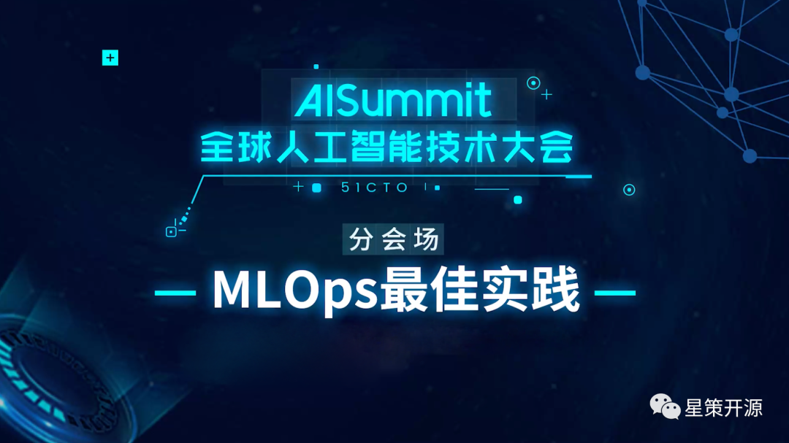
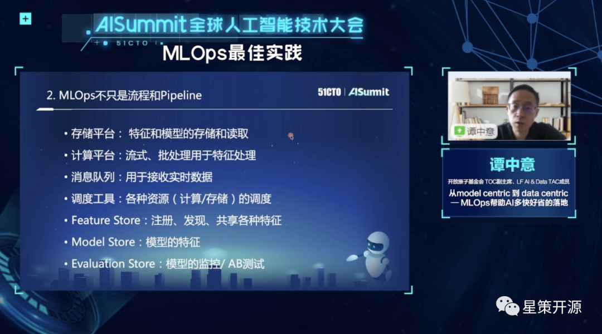
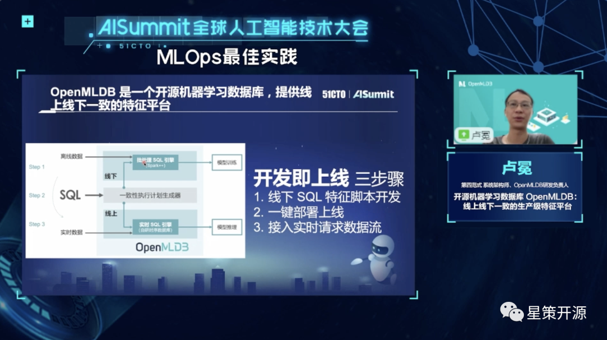
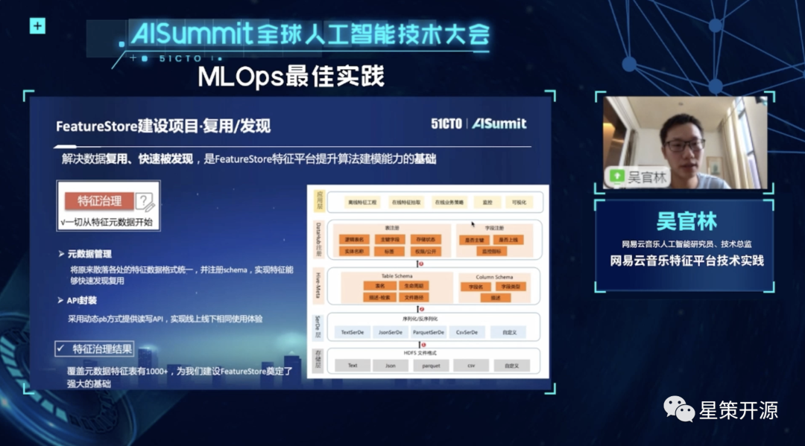
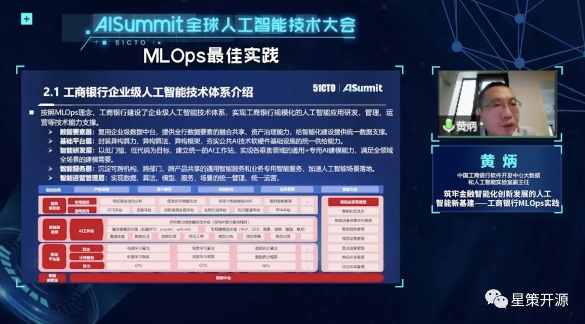

# AISummit 国内首个MLOps专场回顾，最佳实战经验与前沿趋势

2022-08-10 18:03 星策社区

8月6日，AISummit 全球人工智能技术大会以线上直播形式如期开幕。近百位专家学者、技术大牛、管理精英齐聚一堂，与数万名参会者一起共话人工智能时代下的“数智”浪潮。

## 高屋建瓴，解读AI现状与趋势

开幕致辞中，**51CTO副总裁兼总编崔康先生**作为本次大会的总策划表达了对大会的期许。他认为，人工智发展至今，不再像是一门IT领域的细分技术，更像是一种通用技术。其发展虽然一路向好，但也需直面当前存在的诸多矛盾。本次大会希望为这些矛盾提供若干启发线索，找到一些解决路径。同时，也希望“这场大会能够告诉参会者，AI技术和AI开发者正在让世界变得更加美好”。

主论坛中，中国人民大学高瓴人工智能学院副院长窦志成；Meta/Facebook 人工智能研究院研究员及高级经理田渊栋；科大讯飞研究院副院长潘青华；谷歌资深工程师及高级经理、MLPerf 团队负责人周宗伟；火山引擎机器学习系统负责人项亮；微软 Bing 广告文本生成算法负责人刘屹，6位重磅嘉宾站在技术领导者的角度解读了人工智能技术的现状与发展趋势、从业者需要关注的最新研究成果以及前沿技术在业界产生的影响。

## 多维解读，分论坛亮点重点看

大会首日的四场分论坛精彩纷呈、高潮迭起。“AI驱动下的搜索与推荐”、“MLOps 最佳实践”、“机器学习性能优化之路”、“计算机视觉应用与创新”四大议题共包含16个细分话题方向。其中“ MLOps 最佳实践” 专题为星策社区与 51CTO 联合主办的国内首个MLOps主题专场，下文将详细回顾该专题内容。

人工智能在企业规模化应用中，存在研发上线周期长、数据和模型难匹配等挑战。MLOps 应运而生。在“ MLOps 最佳实践”分论坛，专家们围绕研发运维周期、持续训练和持续监控、模型版本和血缘、数据线上线下一致性、高效数据供给等热点方向，探讨了 MLOps 的实践经验和前沿趋势。

星策社区发起人、开放原子基金会 TOC 副主席、LF AI & Data TAC 成员谭中意作为本会场出品人，分享了 “从 model centric 到 data centric—MLOps 帮助 AI 多快好省到落地” ，重点介绍了 MLOps 的概念、定位、主要内容、常见项目，以及评估一个 AI 团队 MLOps 的能力和水平的标准。

第四范式系统架构师、OpenMLDB 研发负责人卢冕在本次大会中分享了“开源机器学习数据库 OpenMLDB ：线上线下一致的生产级特征平台”，围绕开源机器学习数据库 OpenMLDB，分析了其如何实现机器学习特征开发即上线的目标，及如何保证特征计算的正确性、高效性。

网易云音乐人工智能研究员、技术总监吴官林在本次大会中，分享了“网易云音乐特征平台技术实践”，从云音乐业务背景出发，阐释模型实时化落地方案、结合 FeatureStore 进一步辐射到更多场景的思考，分享在特征存储上结合业务落地的改造实践。

中国工商银行软件开发中心大数据和人工智能实验室副主任黄炳在此次大会中，分享了“筑牢金融智能化创新发展的人工智能新基建—工商银行 MLOps 实践”， 重点介绍了工商银行涵盖模型研发、模型交付、模型管理、模型迭代运营的全生命周期管理体系的建设流程及技术实践。

以本次 AISummit 大会为契机，后续，星策社区将持续关注 MLOps 技术赛道及 BI + AI 开源生态、定期举办或参与企业转型、MLOps 交流活动，不断提升社区影响力。同时也将和 51CTO 继续合作，开展更多探索和尝试，为广大技术人员搭建一个人工智能领域的深度交流与分享平台，敬请期待。也欢迎大家持续关注星策社区进展并加入我们。

MLOps专题完整视频回顾：https://space.bilibili.com/1209377375/channel/collectiondetail?sid=623645
