# 国内首届DataOps+MLOps Meetup回顾

2022-03-21 12:26 星策社区

2022年3月12日，由星策开源社区举办了国内首届“DataOps+MLOps Meetup”，活动采用线下参与、腾讯会议、CSDN、51CTO同步直播方式进行。来自第四范式OpenMLDB及ApacheDophinScheduler开源项目核心成员共同带来了一场精彩的技术视听盛宴。

## 活动背景

近几年DevOps在国外的火热程度日渐高涨，同时涌现出了各种Ops，包括DevSecOps，GitOps，AIOps，NoOps，DataOps，MLOps，FeatureOps，ModelOps等等。在这些Ops中DataOps和MLOps在海外市场中的热度一直居高不下，反观国内却还并未兴起，甚至鲜为人知。

基于以上背景，星策社区召开了国内首次“DataOps+MLOps Meetup”，为了让更多工程师了解到DataOps和MLOps是什么，能够干什么，对业务的价值，以及其中的技术难点和相应比较成熟的技术方案都有什么。接下来，将带大家共同回顾本次meetup的主要内容。

## 议程回顾

### Part 1：DataOps+MLOps背景介绍及各类Ops的异同——谭中意

第四范式架构师，开放原子基金会TOC副主席谭中意，在此次meetup中重点介绍了本次活动的背景，DevOps、DataOps、MLOps的概念和各类Ops间的异同之处。

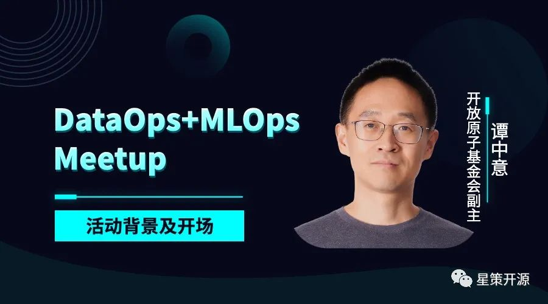

DevOps是将研发与运维联合起来，形成一个DevOps双环，以此打破团队界限，用一种更高效、更流水性的自动化方式来工作，在工程效能领域中非常流行，同时在行业内也衍生出很多创业团队、开源项目以及各类Ops。

这些项目的相同点都是各种Ops任务（Operation）的自动化，都包含相应的流程、工具和角色；不同点是面向不同的领域，涉及不同的角色，以及自动化的任务不同而已。核心还是为了更高效，手段还是自动化。以下是各类Ops的作用、经典工具及使用场景。其中包含本次meetup重点介绍的DataOps领域的DophinScheduler及MLOps领域的OpenMLDB。

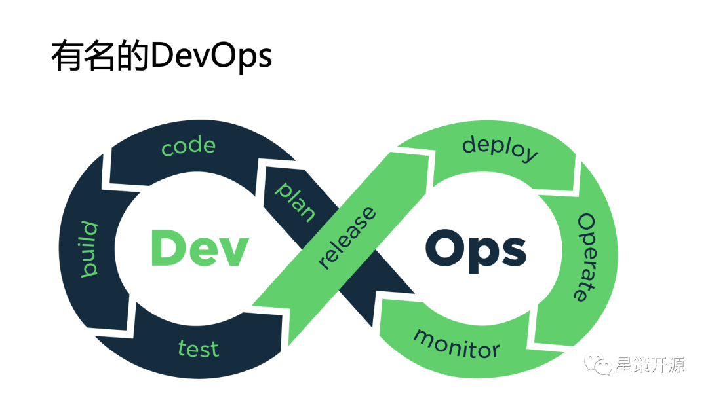

DataOps是在数据分析领域，目标是为了提高数据分析的质量并缩短周期，涉及角色包括数据科学家、数据工程师，IT工程师等，任务包括数据搜集，数据ETL，数据可视化等。

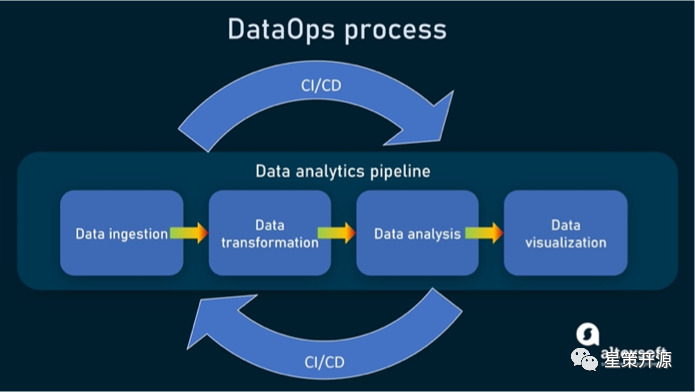

上图较好的展示了DataOps的全部过程，从最左边的数据注入（Data ingestion）到数据转换（ Data transformation）到数据分析（Data analysis）及数据可视化（Data visualization）需要不断由CI/CD工程支持，当数据发生变化，可以自动化的触发这个过程。

而MLOps，是面向的领域是机器学习，目标是提高机器学习落地的效率，涉及角色包括AI科学家、AI数据工程师、IT工程师，任务包括场景定义，数据搜集和整理，模型训练和部署，持续监控和更新等。同样用一个图来表示如下。

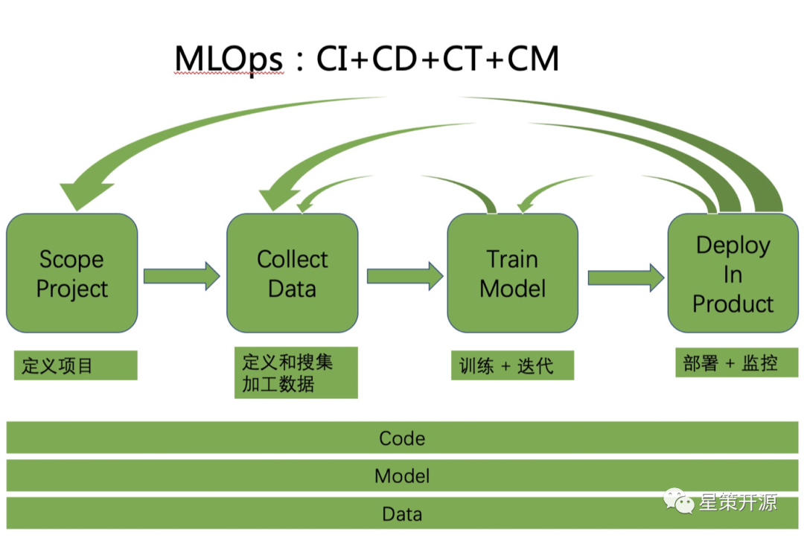

此图将机器学习分成四步，从定义项目到定义和搜集加工数据再到训练迭代最后到部署和监控。每一个环节都需要不断的反复迭代。而模型、代码、数据都需要不断的去做此循环，所以MLOps可以看作是CI+CD+CT+CM。

用一张表来总结DevOps和DataOps以及MLOps的区别。（CI：continuous Integration，持续集成；CD：Continuous Deploy，持续部署；CT：Continuous Training，持续训练；CM：Continuous Monitoring，持续监控）

| 各种 Ops | 对象 | 过程 |
|-----|-------|----------|
| DevOps   | Code     | CI + CD        |
| DataOps     |  Code + Data      |    CI + CD      |
| MLOps     |  Code + Data + Model     |   CI + CD + CT +CM       |

### Part 2：DataOps &DolphinScheduler——郭炜

Apache Software Foundation Member、ClickHouse中国社区创始人、Apache DolphinScheduler PMC、Apache SeaTunnel(incubator) Mentor郭炜-郭大侠在本次活动中重点介绍了DataOps领域国内外现状、DataOps当中的K8S——Apache DolphinScheduler及DataOps当中的数据通道——Apache SeaTunnel。

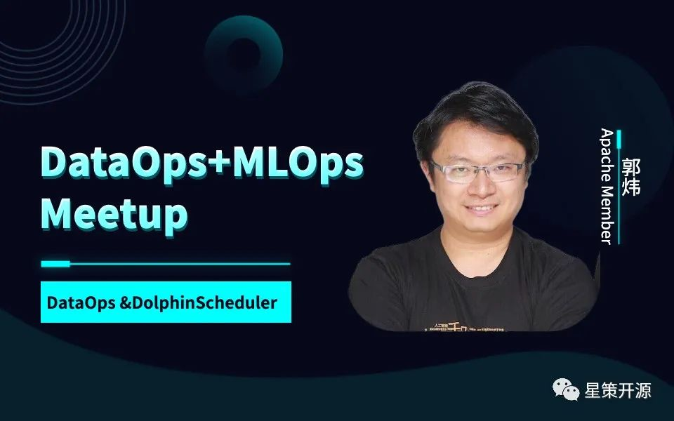

为什么现如今各种Ops爆发性增长？首先，整体上来看，因为中国的数字经济普及，使得整个的产业链迅速增长。其次，中国数据量级的快速增长，一些中国的互联网公司数据量远高于国外。最后，因为数据原始积累已经完成，这种情况下各种的数据分析使得AI平民化出现。所以在数据越来越多的情况下，数据应用的场景也越来越复杂的前提下，Ops出现了以下三大趋势：1.数据量&复杂度变大 vs 用户群场景变复杂、2.国内场景丰富 vs 海外场景专注、3.国内开源技术化 vs 海外开源商业化。

而回到DataOps，它的目的是使得数据处理能力“平民化”，如下图所示：左边有各种各样的复杂的数据源、数据结构，右边是复杂的数据应用场景。在过去是由数据科学家来处理这些数据，但随着场景的复杂，使得将来不仅只有数据科学家、数据分析师、产品经理、甚至普通运营人员都需要用这些数据做各种分析。而DataOps的出现可以使得数据的处理变得“平民化”，因为它既能使得数据能实时互动，有让数据变得非常简便。所以从源数据到目标数据的过程就可以看作是DataOps的过程。

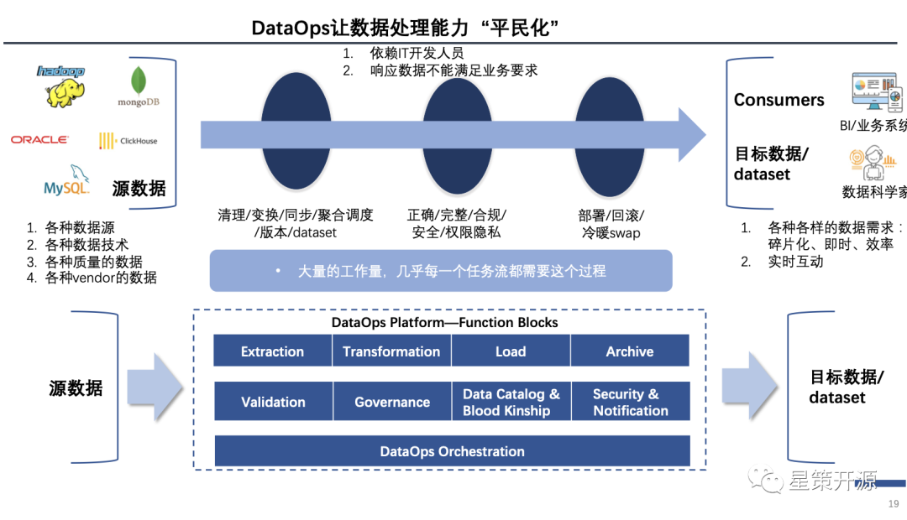

DataOps赛道可以分成以下图谱，右侧是每个企业里的各种大数据平台的架构，下面是N个数据源，也许是Saas，也许是Kafka/Pulsar、confluent等，再往上是各种大数据平台或者数据湖等等数据平台的汇聚，有一部分数据会通过数据流引擎如Flink、AWS Kineses 继续流动，还有一些通过Spark等新型计算平台流动。再向上通过如Presto 等OLAP引擎，之后是Qlik等展示工具，最后是科学技术平台如挖掘引擎推荐引擎等等。图中所有的数据流动，即所有的箭头都是DataOps。而全球所有的DataOps可以总结到左侧，底层调度、数据同步、数据转换、数据治理数据应用安全等。

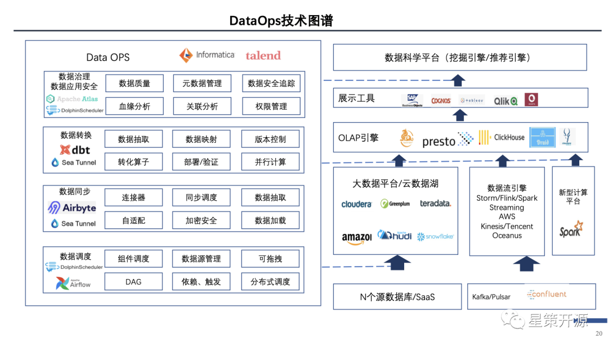

#### DataOps当中的K8S——Apache DolphinScheduler

Apache DolphinScheduler是一个云原生的分布式易扩展并带有强大可视化界面的大数据工作流调度系统。自2021 年 04 月 09 日正式成为 Apache 顶级项目。是首个由国人主导并贡献到 Apache 基金会的大数据工作流领域的顶级项目。2021年12月发布的2.0 版本，贡献者多达289位，性能提升10倍，SPI以及插件化让生态加入更为简单。

同时，Apache DolphinScheduler是一个任务调度，可以通过任务调度的状态即可查看当前哪个任务做的好，哪个出现问题或者需要调试，只需在页面中用点击拖拽的方式即可及时发现问题进行修改调试。它高可靠性、简单易用、丰富的使用场景以及高扩展性、云原生能力，受到如联通、奇安信、荔枝等实际案例中受到了数据平台部门、数据开发者、数据科学家们的欢迎。

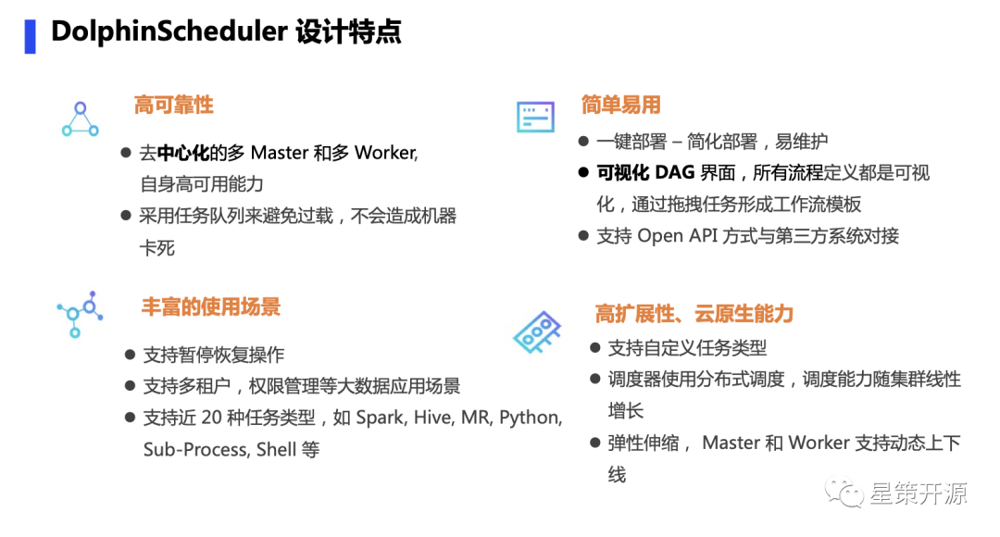

#### DataOps当中的数据通道——Apache SeaTunnel

Apache SeaTunnel(incubating) 是一个简单易用、高性能分布式数据整合与同步工具。是2021 年 12月 31 日正式成为 Apache 孵化器项目。继Sqoop退役后，Apache基金会旗下该领域的明星项目，导师团6位超，过平均的3位一倍。

国内已经在B站、虎牙、去哪儿、腾讯云、唯品会使用，即将发布的2.0 版本，集成最新多个组件Load和Sink资源，同时优化提高ClickHouse等组件Sink性能，尽请期待。

### Part 3：MLOps & OpenMLDB:使用OpenMLDB打造MLOps场景应用——陈迪豪

第四范式平台架构师、开源项目 OpenMLDB 核心研发与 PMC 成员、开源项目 HBase / OpenStack / TVM 贡献者陈迪豪在本次活动中重点介绍了MLOps所解决的问题及使用OpenMLDB打造MLOPs场景的应用。

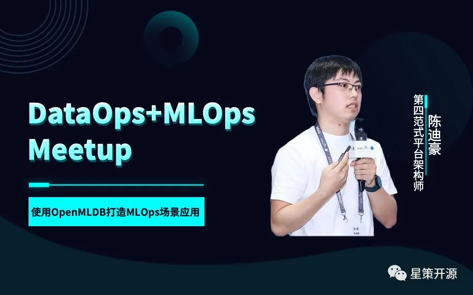

MLOps是一系列的最佳实践，它的目标是在部署和维护机器学习模型的时候能更加可靠或者更加有效。同时它也是机器学习、DevOps、DataEngineeing多个领域的集合。

如下图所示，MLOps是覆盖整个机器学习落地的工具与运维，从机器学习角度看，MLOps分为离线开发和线上服务两个流程。其中离线开发可以分成DataOps、FeatureOps和ModelOps。DataOps包含数据采集与数据存储，FeatureOps包含离线特征计算与特征存储和共享，ModelOps模型训练与超参数调优。之后即可通过部署进行上线，此过程更多关注于实时数据的处理，通过数据流的接入、请求，实时特征的计算以及通过在线推理进行结果数据回流形成结果反馈，进而进行下一轮的迭代。

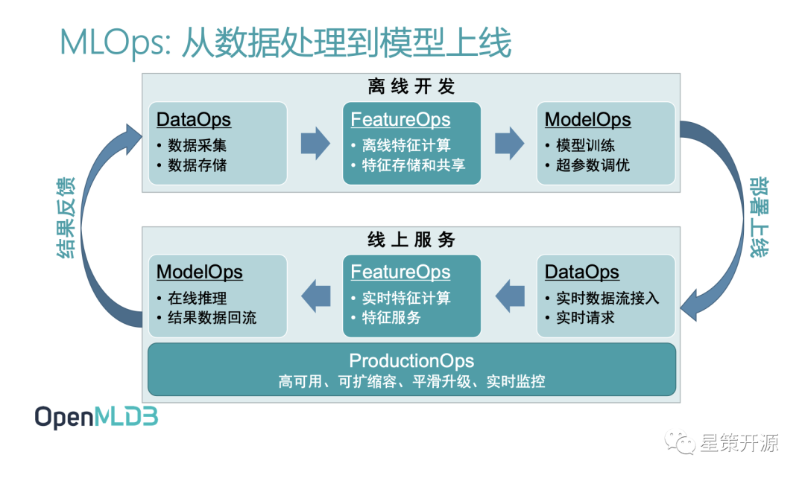

和大部分DevOps、DataOps在落地过程中遇到的问题类似，MLOps也遇到了很多难点，这里重点介绍两个方面，首先是线上线下一致性校验问题，其次是实时特征拼接和聚合。问题一主要是因为进行离线开发与线上服务的科学家与工程师所使用的工具不一致。问题二主要是因为我们在建模过程中数据来源不会只来源于一个主表，收到的可能是用户数据、商品数据、交易数据等，需要将相应数据的进行拼接和聚合才能进行后续实时特征模型训练。

而OpenMLDB则可以恰当的解决MLOps领域关于特征数据的问题，它极大的提升机器学习上线的效率，并降低机器学习从业人员的门槛。比如为了解决线上线下一致性校验的问题， OpenMLDB仅需要通过三个步骤完成开发即上线的要求如下图，即1.线下SQL特征脚本开发 2.一键部署上线 3.接入实时请求数据流。内部通过一系列的组件和技术来帮助用户高效实现离线和在线的特征抽取，将正确数据供给给训练和预估服务。同时它还拥有线上线下一致性执行引擎、以SQL为核心的开发管理体验、离线计算引擎优化、在线计算存储引擎优化、标准ANSI SQL支持及端到端AI工作流支持等特性。

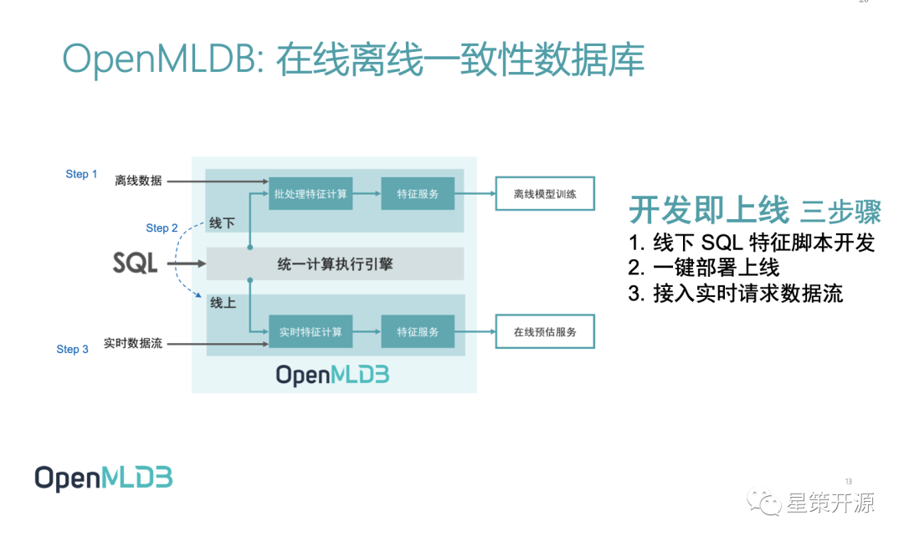

OpenMLDB在MLOps的应用场景也非常广泛，如在银行事中反欺诈交易中，OpenMLDB 提供分布式、可扩展的在线预估服务快速响应能力，可以将毫秒级变化作为特征入模。提供了针对特征抽取语言、模型训练框架、离线存储引擎、在线存储引擎、在线预估服务的解决方案。

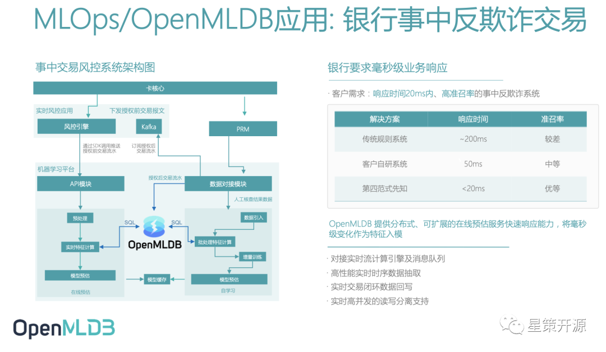

### 总结

DataOps 和 MLOps作为各种Ops中的后起之秀，可以在各自领域即数据分析和机器学习领域，起到很大的作用。虽然国内现在还不是很流行，相信随着国内大数据和机器学习在更多企业的落地，尤其是企业数字化转型的推进会极大促进这两者的进一步发展。最后欢迎大家持续关注DataOps及MLOps的讨论。 

### 视频回顾（B站：星策社区）

DevOps后的各种Ops相同点和区别在哪？——谭中意

链接：[https://www.bilibili.com/video/BV16P4y1M7xC?spm_id_from=333.999.0.0
](https://www.bilibili.com/video/BV16P4y1M7xC?spm_id_from=333.999.0.0)

DataOps &DolphinScheduler——郭炜

链接：[https://www.bilibili.com/video/BV1FT4y1U7Kp?spm_id_from=333.999.0.0](https://www.bilibili.com/video/BV1FT4y1U7Kp?spm_id_from=333.999.0.0)

使用OpenMLDB打造MLOps场景应用——陈迪豪

链接：[https://www.bilibili.com/video/BV1FS4y1D7gB?spm_id_from=333.999.0.0](https://www.bilibili.com/video/BV1FS4y1D7gB?spm_id_from=333.999.0.0)