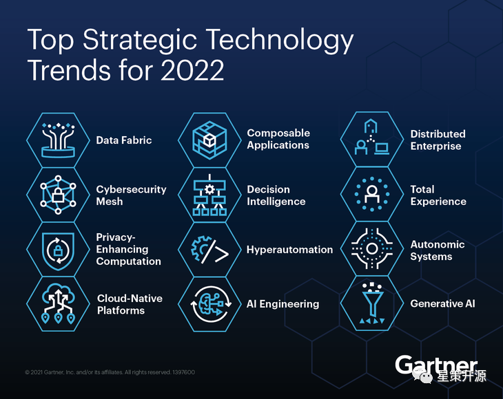
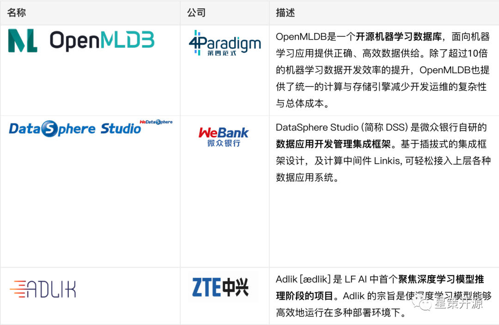

# 工程师如何拥抱数字化转型？

星策开源  2022-08-19 18:00

## 数字化转型时代

这是一个数字化的时代。数字化已成为了当下社会的主旋律之一。正如“十四五”规划中重点提到的，“ 加快数字化发展，建设数字中国“，加快推动数字产业化，产业数字化。

人类已经经历了三次工业革命，对应蒸汽时代、电气时代和信息时代。在信息时代，信息技术驱动的第三次工业革命已经让互联网和移动互联网成为了我们生活中必不可缺的一部分。

而现在，以大数据和人工智能技术为驱动的第四次工业革命，正在紧锣密鼓的进入我们的生活。

1998 年图灵奖获得者 Jim Gray 在2007年提出“四个范式”的概念，将人类历史的发展科学，分成了四个阶段，及“四个范式”。其实，人类科学史就是范式的历史，伴随着范式的成长，人类也在不断地成长。

第四范式为：实践科学、理论科学、技术科学和数据科学。

疫情加速了全球数字化的进程，国内在一些行业的数字化转型已经引领全球。在这样的浪潮里，身处数字化建设中心的工程师要如何利用自己的职业优势，来利用好数字化转型带来的机遇与挑战呢？

## 机遇与挑战

对于工程师来说，有以下几类机会：

### AI 工程化（MLOps）

2021年10月，在Gartner发布的《2022年十二大重要战略技术趋势》中，Gartner将“AI Engineering（AI工程化）”列为企业创新的重要加速器。当前，较新的“AI Engineering”大致与较早的“MLOps”是同义词，这两个概念的背景也类似。有 DevOps，则对应就提出了 MLOps，有 Software Engineering，则对应就提出了 AI Engineering。

对于工程师，尤其是 AI 工程师来讲，了解  MLOps，参与到 MLOps 的技术社区当中去，通过不断地碰撞和尝试，加深自己对不同新技术的认知，是一件值得挑战的事情。

星策社区自 2022 年 3 月 30 号发布以来，举办过三次 MLOps 相关主题的技术活动，感兴趣的同学可以点击[活动回顾](https://space.bilibili.com/1209377375?spm_id_from=333.337.search-card.all.click)

此外，2022年8月6日，星策社区与 51 CTO 联合主办了 AISummit “ MLOps 最佳实践” 专题，为国内首个MLOps主题专场：AISummit 国内首个MLOps专场回顾，最佳实战经验与前沿趋势！

### 拥抱开源

身处数字化时代的软件开发，往往“越开放、越强大”。特斯拉开源了所有的汽车相关专利，但仍是新能源汽车领域的技术领袖。对于今天的软件开发，如何用好开源软件已经是一个再普适不过的话题。

身为工程师，拥抱开源就成为了一种极佳的选择。参与开源社区，与社区共同成长，在社区内拥抱最新的技术和最真实的使用反馈。开源意味着持续不断地成长、进化。

关于开源更多内容，可参考星策社区发起人-谭中意老师关于开源的相关文章。

工程师如何对待开源：https://my.oschina.net/u/3742410/blog/5526206

开源到底是什么：https://my.oschina.net/u/3742410/blog/5520919

星策社区目前开源项目包括：OpenMLDB、DSS、ADlik，欢迎工程师同学积极参与共建，同时也期待更多开源项目加入星策社区。

OpenMLDB：https://openmldb.ai/

DSS：https://github.com/WeBankFinTech/DataSphereStudio

ADlik：https://github.com/Adlik/Adlik

### 拥抱业务，创造业务价值

在数字化转型的时代浪潮里，工程师的日常工作不可避免要关注技术本身，但如何跳出过度关注技术细节的怪圈。就要跳出去，与不同背景的同事、不同技术领域的社区成员进行探讨与交流。

开放的沟通让工程师能更加了解客户的需求，场景的设计以及技术实际运用到场景中创造了怎样的价值。

未来，星策社区会邀请在数字化转型领域取得较大成果的企业来进行数字化转型业务相关的分享，深入了解聚焦到具体的业务场景中，技术是如何作为基石支撑转型业务大放异彩，敬请期待。

## 关于星策社区

如今，国家大力推进数字经济蓬勃发展，千行百业都在紧抓时代机遇转型升级。业界亟需一个交流、共享的平台，合力破解智能化转型困境。

国内首个企业智能化转型开源社区——星策社区应时而生，该社区以共享共建的方式连接企业和 AI，助力企业智能转型成功为使命，聚焦于企业智能转型，是一个由企事业单位、高等院校、科研单位、非营利性组织等各方按照自愿、平等、开源、协作的基础上组成非盈利性开源社区。

与过往多聚焦在单一技术领域的开源社区不同，星策社区将持续探索并共享共建企业智能转型“方法论”、优质案例、最佳实践及支撑企业智能转型的开源技术，助力企业进行智能化转型；同时社区也将定期举办不同类型活动，邀请各领域的顶尖专家剖析行业、技术发展趋势。

有关星策智能化转型开源社区的更多详情，请点击「阅读原文」访问社区官网（http://startogether.ai/）。