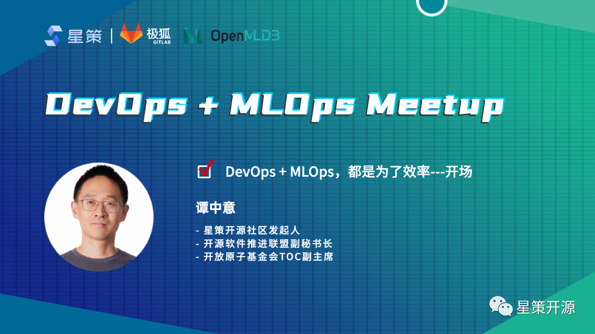
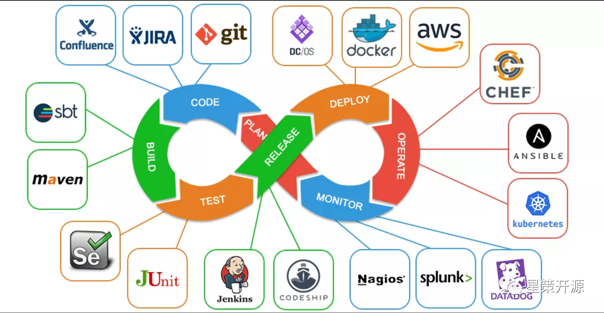
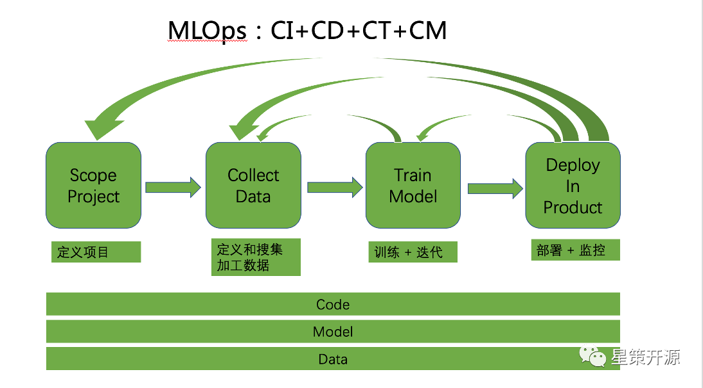
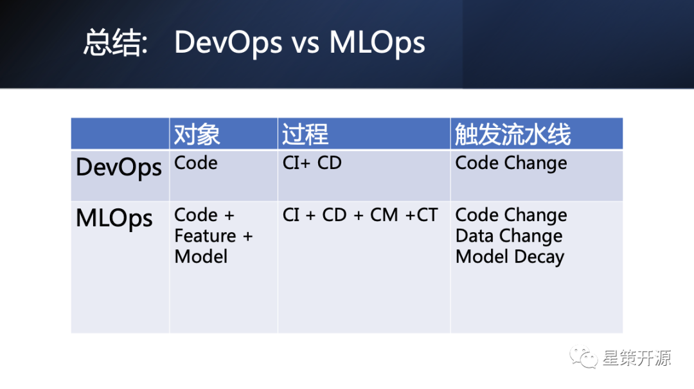
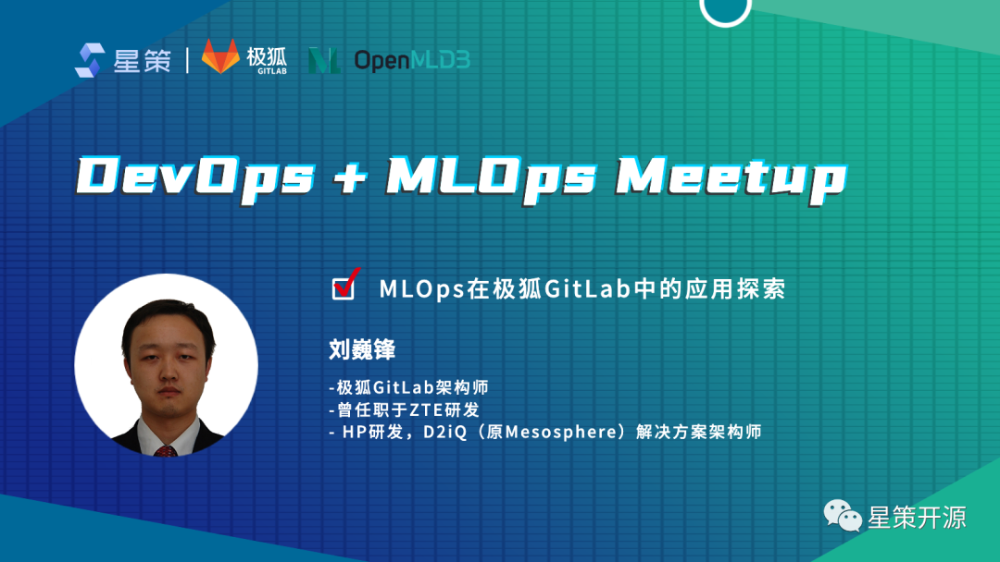
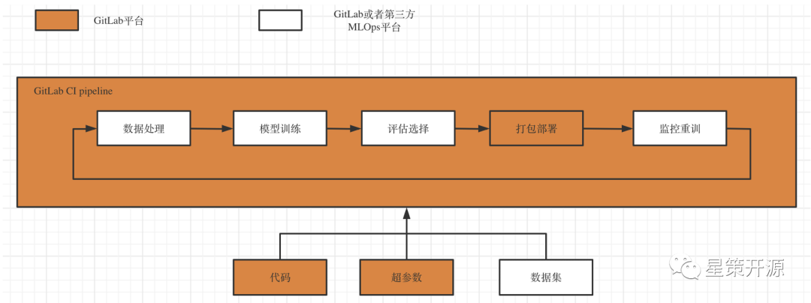
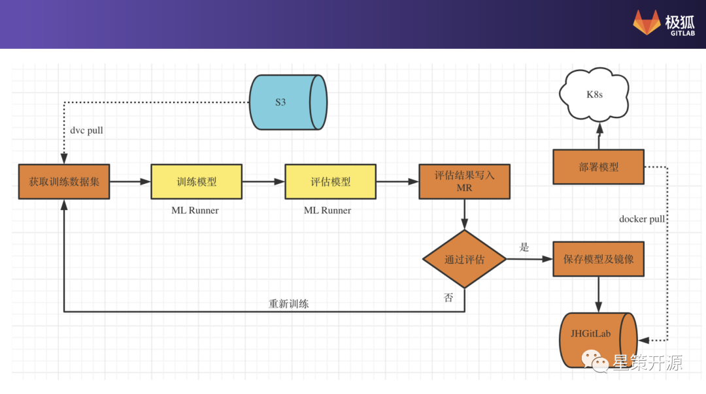
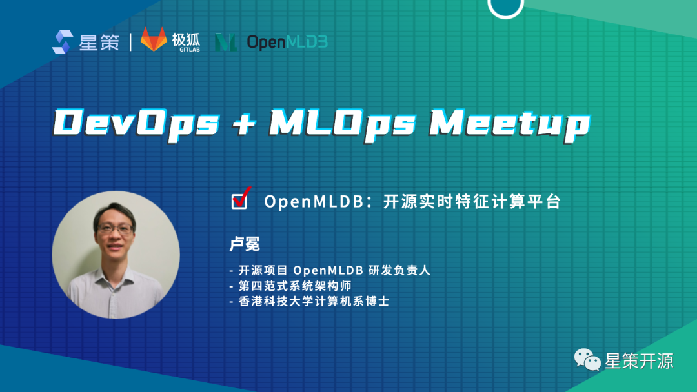
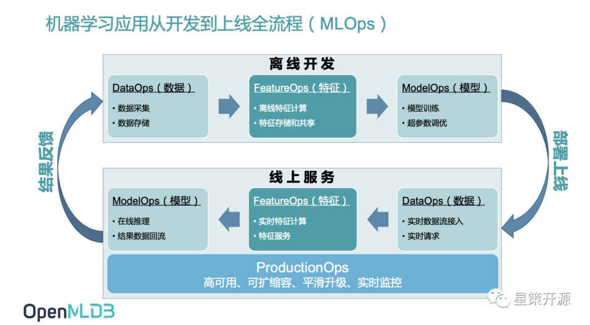
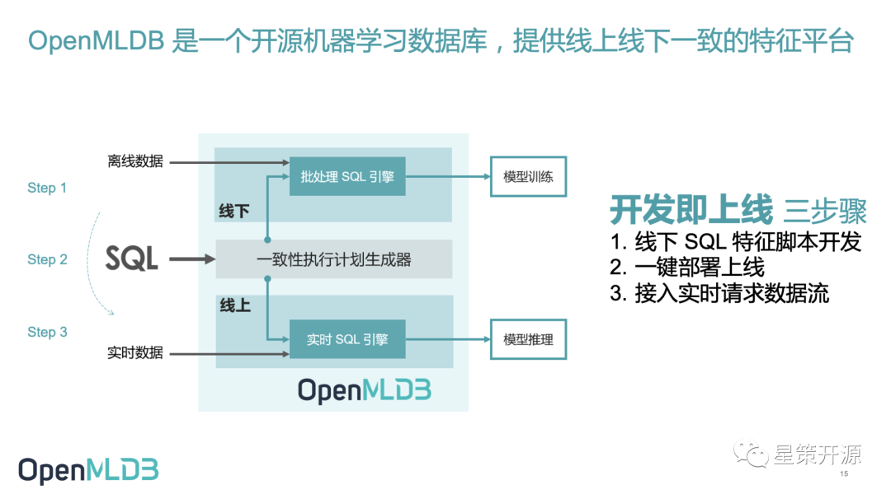

# DevOps + MLOps Meetup 回顾

## DevOps & MLOps 如何在企业中解决机器学习困境？

2022-06-12 17:21:10 星策社区

6月5日，由星策社区主办的「DevOps+MLOps Meetup」于线上召开，活动由**51CTO视频号、CSDN直播间、开源中国视频号、极狐GitLab视频号四平台同步支持，累计观看人次超过5000**。

星策社区发起人——谭中意，在本次活动中重点介绍了DevOps与MLOps的概念与异同之处；

极狐GitLab架构师——刘巍锋，分享了如何使用传统的代码管理工具和流水线平台 Gitlab，实现机器学习模型的开发自动化；

第四范式OpenMLDB研发负责人——卢冕，介绍了如何使用OpenMLDB解决特征线上线下一致性问题，加速机器学习的开发和上线过程。

🌟本文根据三位老师分享的重点内容整理而成，PPT获取请**关注公众号「星策开源」并回复「0605」**🌟

## 精彩内容回顾

### Part1：DevOps+MLOps，都是为了效率—谭中意

星策社区发起人，开源软件推进联盟副秘书长，开放原子基金会TOC副主席—谭中意，在此次meetup中重点介绍了DevOps、MLOps的由来、概念和两者的异同之处。

#### 什么是 DevOps

DevOps这个词从提出来流行在国内已有将近有十来年的历史，他的目标是在保证质量的基础上更快的Deliver软件。在传统的工作模式下面，Dev（开发者）负责将编译好的代码交给Ops（运维团队）部署到线上，前者关心的是更快的上线，实现功能，后者关心的是系统的稳定性与可用性，因为目标的不一致，造成在传统研发模式下，Dev与Ops的矛盾越来越大，形成了一道阻碍沟通的“部门墙”。

为了解决这一问题，打破这道墙，出现了一种新的研发模式即DevOps。通过CI+CD让研发与运维联合起来，形成一个DevOps双环，以此打破团队界限，用一种更高效、更流水性的自动化方式来工作。这种方式后来被广泛应用，如今已有十多年之久，同时也出现了各种形式的Ops和以及工具，目标是为了提升机器学习落地的效率。

#### 什么是 MLOPs？

MLOps是面向机器学习领域，为了提高机器学习落地效率的。其中涉及角色包括数据科学家和软件工程师。他的任务包括定义场景、数据收集和整理、模型训练和部署、持续监控和更新，这是一个完整的pipeline的四个部分，在这一套生命周期里面每一个环节他都需要更快的迭代和更快的反馈。同时它的范围不仅仅只是代码，还包括模型和数据。所以简单来说MLOps就是包含了代码、模型和数据的持续集成、持续部署、持续训练和持续监控，同时还包括了各种平台工具，比如FeatureStore、ModelStore、ModelMonitoring等。

#### DevOps Vs MLOps

不同点：对于DevOps和MLOps来说，他们面向的对象、过程和触发方式是不一样的。DevOps的触发方式主要是代码的修改，而MLOps不仅仅是代码修改，当数据发生修改、Model Decay模型性能发生衰退都会触发流水线。

相同点：DevOps与MLOps的出现，都是为了提升效率。其实不管是什么OPS，它的目标都是为最终的用户创造价值。DevOps与MLOps的基本理念也是相同的，包括都是尽可能的自动化；对于提升实践的关键特点、关键做法也是相同的，其中系统的思考，尽快的反馈，持续的学习和改进，被称之为DevOps的3个方法论，在MLOps里面同样适用。

### Part2：MLOps在极狐 GitLab 的应用探索——刘巍锋

极狐GitLab架构师——刘巍锋在此次meetup中重点介绍了极狐GitLab中的MLOps，以及使用GitLab实现MLOps所面临的挑战和展望。

#### MLOps是什么

MLOps 就是机器学习时代的 DevOps。它的主要作用是连接模型构建团队和业务，运维团队，建立起一个标准化的模型开发，部署与运维流程，使得企业组织能更好的利用机器学习的能力来促进业务增长。

#### 极狐GitLab中的MLOps

众所周知，极狐GitLab是MLOps领域里一个非常成熟的产品，它的强项领域就是在DevOps。而DevOps和MLOps的高度相似让极狐GitLab产生了思考，能不能借助DevOPS平台来解决一些MLOpd的事情呢？基于此，为GitLab进行重新定位，让极狐GitLab 成为机器学习工程师和数据科学家的完美伙伴和工具，并在整个机器学习生命周期（模型创建、测试、部署、监控和迭代）中为他们提供更好的用户体验。

如下图所示，橙色部分属于GItlab，白色部分属于由第三方平台或者工具来提供的。其中代码、超参数、部署等过程可以使用GitLab来完成。整个过程可以理解为一个机器学习pipeline，这个pipeline是通过使用GItlab自带的CI pipeline所实现的。

#### 当前现状

GItLab当前针对MLOps所做改进有以下几点：

- 部署脚本保存在单独project中
- JH GitLab的agent server监控内容是否有更新
- Agent server通知k8s中的agentk配置更改
- agentk根据情况更新部署环境

#### 极狐GitLab的探索

下图所示为当前实现的流程图，中间的每一步都可以看作GitLab Pipeline中的Job，每一个工作都在GitLab的MLRunner中，可以认为它是一个执行器。整体上看，通过DVC把S3中的指定的训练数据集拉下来，进行模型训练，之后进行模型评估，结果算出后写到MR中去，基于这些信息产生一个评估结果，数据科学家根据评估结果进行再次评估、更改。如果不符合需求，可以选择将MR丢掉不处理，或者回到训练数据/代码/配置重新更改，再次触发整个流程。如果符合需求，这个MR的代码才会合并到主分支中去，同时把生成镜像以及模型保存下来。

最右边CD过程，是通过JH GitLab KAS的GitOps工作流模式实现，包含以下几个特点：

- 完美支持ipynb格式文件（{`>`}v14.5）
- 整合MLFlow （进行中）
- JupyterLab插件  （进行中）
- 与客户在大数据/机器学习领域展开探索实践

#### 面临的挑战和展望

对于当前使用GitLab实现MLOps 面临着以下挑战：1:用户需要熟悉GitLab CI，GitOps等工具和流程才可以实现。2:极狐GitLab暂时没有MLOps模版可用。3:缺少与其他主流ML框架/工具整合方案。4:海量数据的传输保存面临挑战。未来Gitlab将针对以上问题进行不断探索与改进。

### Part3：OpenMLDB：开源实施特征计算平台——卢冕

第四范式系统架构师、OpenMLDB研发负责人——卢冕，在此次meetup中重点介绍了OpenMLDB解决机器学习全流程（MLOps）特征问题。

如下图所示，MLOps 可以看作机器学习应用开发到上线的全流程，它包含离线开发和线上服务两部分，这两套流程中同时包含从数据到特征计算到模型训练的全过程。和大部分DevOps落地过程中遇到的问题类似，MLOps也遇到了很多难点，重点包含两个方面，首先是线上线下一致性校验问题，其次是实时特征拼接和聚合问题。

OpenMLDB 可以恰当的解决 MLOps 过程中关于特征数据 FeatureOps 的问题，应用于决策类场景基于时序数据的特征工程，可以极大的提升机器学习上线的效率，满足生产级上线需求的实时推荐系统，降低机器学习从业人员的门槛。

从架构来看，OpenMLDB对外提供了唯一的开发语言SQL，数据科学家只要会写SQL就能用SQL开发特征计算脚本。从内部看，OpenMLDB有两套引擎，一套是批处理的SQL引擎，另一套是实时的SQL引擎。批处理的SQL引擎主要针对线下开发过程，基于Spark做了一些源代码级别的优化，可以更好的处理特征平台特征计算。而实时SQL部分，OpenMLDB团队从零构建了一个分布式的时序内存数据库，完全针对于时序数据优化的一个SQL引擎。架构图中间是一致性执行计划生成器，它承接输入方的SQL，在内部自动转换成线下的执行计划和线上的执行计划，从内部自动保障了线上、线下计算逻辑的一致，省去人为的线上线下一致性的校验过程，做到开发即上线。简单总结来看只需要三个步骤就可以完成这个过程，即

1.线下SQL特征脚本开发。
2.一键部署上线 3.接入实时请求数据流。

目前OpenMLDB 新版本v0.5.0 带来了性能、成本、灵活性的重大优化升级。主要升级体现在：1.通过预聚合技术，显著提升可长窗口性能。2.成本降低。提供了基于内存和外存的两种存储引擎选择，大大降低了成本。3.易用性增强。支持C/C++ UDF，并支持UDF动态注册，方便使用者扩展计算逻辑，提升了应用覆盖范围。总结来看，新版本的 OpenMLDB 在线性能数量级有了大幅提升，提供了低成本落地选择，使用场景的灵活性也得到扩展。未来0.6.0版本将更加关注易用性和可运维性，包括数据库状态自检和报告工具、查询调试和 tracing 工具、数据库性能分析和统计报告生成工具、Flink connector、整合特征编码等相关算法等。

### 总结

DevOps与MLOps的出现都是为了提高企业的效率，提升研发领域的效率，为了更好的给客户提供价值。而 MLOps 作为基于 DevOps 发展而涌现出的后起之秀，可以在领域即数据分析和机器学习领域，起到非常大的作用。相信随着企业数字化转型纷纷进入到高级阶段即智能化阶段，AI 在企业大批的落地并发挥关键作用，MLOps 也会成为热词，并在未来的 10 年内，成为业内 AI 落地的必不可少的默认词。

最后，欢迎大家持续关注 DevOps 与 MLOps，加入交流群和我们一起讨论 MLOps 相关内容。
