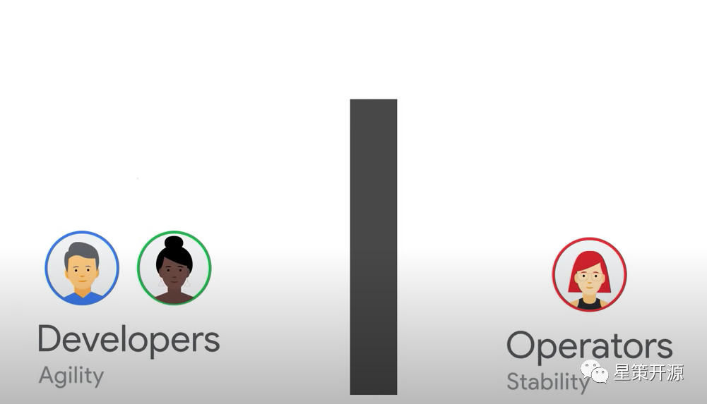
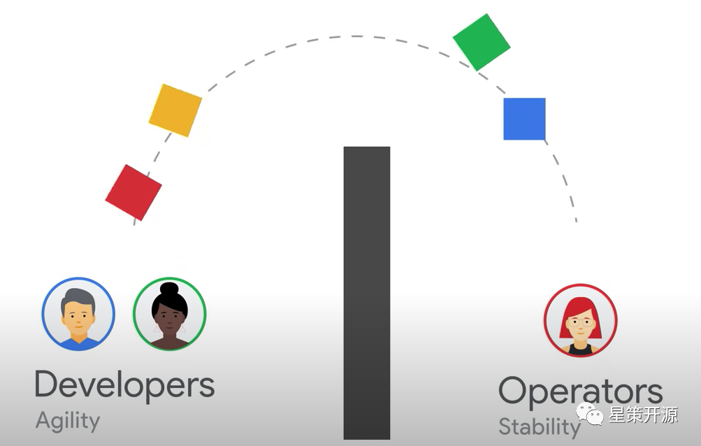
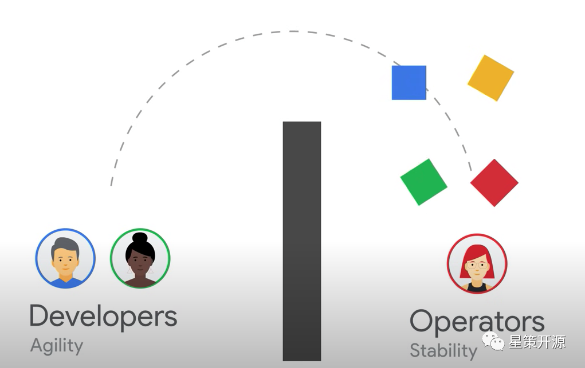
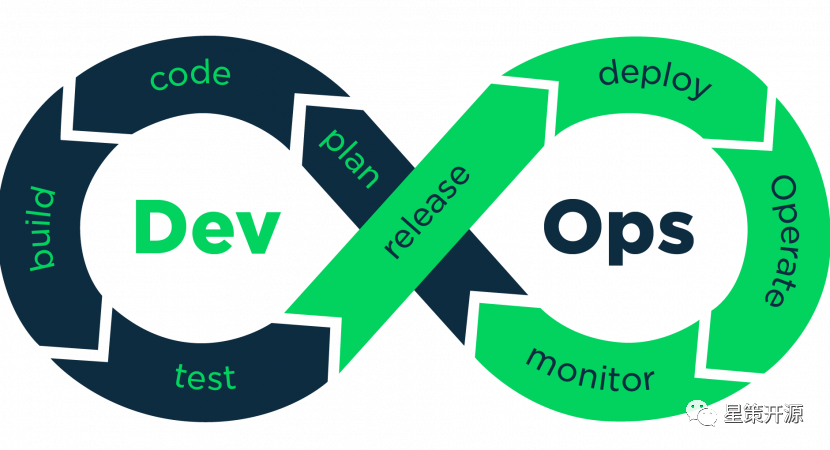
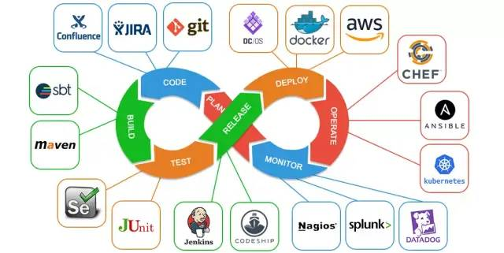
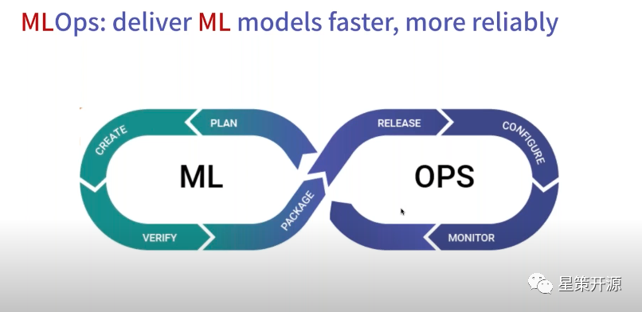
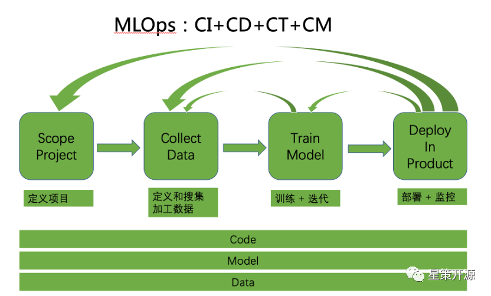
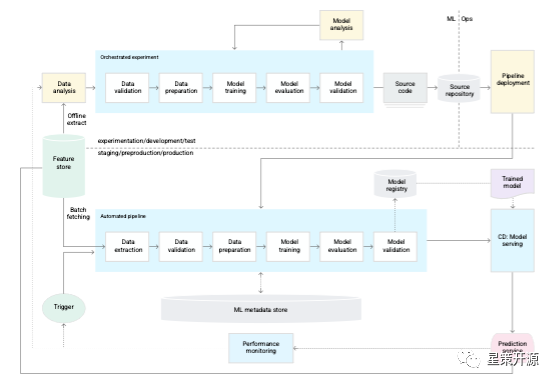

# DevOps + Machine Learning = MLOps ?

2022-06-12 17:21:10 谭中意

前言：近日，企业智能化转型开源社区 --- 星策社区组织了 DevOps 和 MLOps 的 Meetup，是把 DevOps 和 MLOps 拉在一起进行分享的社区活动，笔者作为该活动的组织者，写点东西来说下这两者的关系和异同，并做回顾。

## 什么是 DevOps？

最近看好友乔梁（江湖人称乔帮主）的朋友圈，他说他曾经在 2012 年 QCon 大会 DevOps Track 上预言 “过去十年敏捷从热词成为市场主流，未来十年 DevOps 将成为市场的主流”，如今是 2022 年了，他的预言成为现实，DevOps 基本上已经成为每个技术企业、每个工程师都耳熟能详的一个词了，也有很多企业已经在进行或多或少的 DevOps 实践推行了。
那么什么是 DevOps？
摘自百度百科上的定义如下：

> DevOps（Development 和 Operations 的组合词）是一组过程、方法与系统的统称，用于促进开发（应用程序 / 软件工程）、技术运营和质量保障（QA）部门之间的沟通、协作与整合。
> 它是一种重视 “软件开发人员（Dev）” 和 “IT 运维技术人员（Ops）” 之间沟通合作的文化、运动或惯例。透过自动化 “软件交付” 和 “架构变更” 的流程，来使得构建、测试、发布软件能够更加地快捷、频繁和可靠。
> 它的出现是由于软件行业日益清晰地认识到：为了按时交付软件产品和服务，开发和运维工作必须紧密合作。
> 百度百科

我总结一下，DevOps 有如下三点是做的非常出色的。

## 1. 打破 Dev 和 Ops 之间的部门墙

在传统研发模式下，Dev（即软件开发人员）和 Ops（IT 运维人员）之间存在一个墙导致协作不顺畅，我们来看看 Google SRE 团队对 DevOps 的解读（Google SRE 团队认为是 SRE 是 DevOps 的一种实现），我截取其视频（https://www.youtube.com/watch?v=uTEL8Ff1Zvk&t=112s）中几个图来解读一下。

在传统研发模式下，Developers（软件研发人员）和 Operators（IT 运维人员）分属于不同的团队，两者之间有一个 “部门墙”（专业术语叫 Silos）。Dev 关心 Agility 即产品功能的快速迭代，Ops 更关心 Stability，即系统的稳定性。从部门分工和岗位职责来看，Dev 希望更多更快的 Code Change，Ops 则希望更少的代码修改，因为在传统运维模式下，系统没人动则出事概率小，而实际上很大概率的线上问题都是因为上线引起的，所以对于运维同学来说，线上出问题的第一反应是谁刚才上线了，是否可以无脑回滚来解决问题。

软件研发人员做好开发和测试之后，把生成好的软件包，扔过 “墙” 去，然后就交给 IT 运维团队负责了。这个移交过程在某些公司做的比较规范，会设定一定的准入条件门槛，例如需要清晰完整的测试报告、完整详细的上线文档（包括如何回滚）等，基本上都是为了运维方便，这种模式下研发不太关心线上稳定性。

IT 运维团队在接受这些软件包之后，部署到线上环境里面。他们负责这些系统的稳定性运行，可能会采用小流量到全流量部署，多地多机房分布式部署等，来提升系统的稳定性和健壮性。线上服务的稳定性，包括常见的几个 9，往往是运维同学的 KPI。

DevOps 首先是打破了这个墙，促使软件开发人员和 IT 运维人员更好的协作，因此产生了很多落地的实践，包括团队组织上，例如更小的敏捷团队、开发运维一体化；代码和配置共享，例如内部开源、Configuration As a Code；运维任务共享，例如研发也 OnCall（即线上运维值班，第一时间处理业务报警和事故）等等。

## 2. 把自动化流水线扩展到了运维环节

包括 Continuous Integration（简称 CI）和 Continuous Deployment（简称 CD）。在 DevOps 之前的工程实践为敏捷，往往只有 Continuous Integration，只覆盖了编码，编译，测试，打包环节，并没有覆盖部署环节。

这是非常著名的 DevOps 双环流水线模型，左半边集中在软件研发阶段，从 Plan（需求定义），到 Code（编写代码），然后到 Build（编译），再通过 Test（测试），最后生成软件包，形成 Release（发布）。

右半边集中在软件部署阶段，从获得软件包开始，Deploy（部署），然后 Operate（线上运维），再到 Monitor（监控线上服务）。

两个环构成 DevOps 的完整流水线，这个流水线的运转是持续的，左半边一般称之为持续集成（Continuous Integration），右半边一般称之为持续部署（Continuous Deployment）。显然这个流水线运转的速度说明了该研发运维团队的工程能力。当然，是需要在保证一定质量的前提下的快。也不是部署频率越多越快就越好，需要每次迭代都是朝着提升业务价值的目标，不断逼近理想值的迭代。

DevOps 业内的有名的调研报告《State of DevOps 2021》（https://cloud.google.com/blog/products/devops-sre/announcing-dora-2021-accelerate-state-of-devops-report）
中指出，Elite 团队（即在 DevOps 领域内做的出色的团队）能做到按需部署（每天可以做很多次部署），而一般的团队部署周期在一周或者一个月左右，再差一点的团队部署周期在一个月到半年左右，最差的团队部署周期在半年以上。

## 3. 利用工具来支持自动化，并形成了繁荣的工具生态

这只是我在互联网上随机找的一个图，类似的图还有很多种，特点是 DevOps 的流水线上每个环节都有多个工具在支持，在协作。这里面有开源的软件，例如 git，gitlab，gradle，jenkins，也有商业的软件和服务，包括 Azure 和 AWS 等。

DevOps 的推广和运营如此成功，之后又有很多类似的名词产生出来。包括 DevSecOps，GitOps，DataOps，ModelOps，AIOps，NoOps，MLOps 等等。其中 AIOps 是指用 AI 的能力提升传统运维的能力，包括利用机器学习来进行流量预测来帮助进行流量调度，利用机器学习来进行硬件寿命预估来帮助进行硬件成本控制等。NoOps 指的是减少业务的运维操作，把业务系统的运维操作下沉到底层的基础设施的运维上。

其他各种 Ops 都是各种 Operation（Ops）的自动化，都包含相应的流程和工具（即通过工具自动化来完成所需要流程），Ops 都包含相应的角色，不同点是具体哪个领域内，哪些任务的自动化，流程、工具、角色各异。

例如 MLOps 就是在机器学习领域内，目标是为了提升机器学习落地的效率。
下面将详细的介绍 MLOps。

## 什么是 MLOps

MLOps 目前没有特别清晰一致的定义。

来自 Wikipedia 的定义如下：

> MLOps  is a set of practices that aims to deploy and maintain Machine Learning models in production reliably and efficiently.
> Wikipedia

（有人认为 MLOps 和 ModelOps 是同一个概念，笔者认为 MLOps 的 ML 是指 Machine Learning，而不只是 Model 的缩写，MLOps 所包含的概念比 ModelOps 的概念要广泛，ModelOps 指的是模型（Model）相关的开发和运维自动化，而 MLOps 关心的内容不只是 Model，还包括 Data 和 Code。）

也有人认为 MLOps 就是机器学习领域的 DevOps， 即

***DevOps + Machine Learning = MLOps***

对此，我的看法是 MLOps 跟 DevOps 有很多观念和实践是相同的，但是 MLOps 相对 DevOps 也还有不少独特的地方。

我们先来对照上文中 DevOps 的三个优点来理解 MLOps；

### 1. 打破部门墙

DevOps 是打破了软件研发运维活动中关键角色 Dev（软件研发人员）和 Ops（IT 运维人员）的部门墙，推动他们更高效的协同工作。

MLOps 同样也是打破了机器学习研发运维活动中关键角色 Data Scientist（数据科学家）和 Software Engineers（软件工程师）之间的部门墙，推动他们更高效的协同工作。

其中数据科学家，职责是利用数据训练出较好的模型出来；经常是基于给定的数据集进行工作；工作重点是改进模型从而达到模型所需要的准确率、召回率等性能指标；往往是在 Jupyter Notebooks 上进行工作；他们很擅长构建模型和特征处理；但是并不关心模型大小、成本、延迟、QPS 等指标。

而软件工程师，职责是拿到模型之后在线上进行部署，对线上请求进行预测，从而实现商业价值；他们对最终产品负责，关心成本、性能和稳定性，关心客户的满意度，对可扩展性和自动化花很大力气，他们往往需要长期维护一个产品。

这两种角色都是机器学习在企业落地的必不可少的角色。但是在如今的机器学习开发上线流程和组织架构设计中，往往这两个部门因为关心点不同，存在很厚重的部门墙，导致机器学习落地时间长，效果不达预期，而且有可能因为时间流逝而出现预测效果回退的情况。

所以，MLOps 也需要跟 DevOps 一样，打破部门墙，关键角色之间需要紧密的协作。

### 2. 同样需要流水线

流水线是自动化操作的集合，能极大的加速开发和运维的运转。

上图是我从互联网找到的一个双环流水线 MLOps 的图，还有三环模型的 MLOps 图。我个人比较倾向双环模型。

双环模型中，左半边是机器学习训练过程，目标是通过数据训练出比较好的模型，来找出数据间的规律，模型需要有比较好的预测结果；右半边是机器学习的预测过程，当模型已经得到之后，部署到线上，进行各种线上配置，并持续进行监控线上服务。

MLOps 的流水线不仅仅只有持续集成（CI）和持续部署（CD），还包括持续训练（CT）和持续监控（CM），而且对 CI 和 CD 的内容也有扩展。

- Continuous Integration（CI）：不仅仅是对代码（Code），还包括对数据（Data）和模型的持续测试和验证。
- Continuous Delivery（CD）：不仅仅对软件包进行持续部署，还包括对预测服务的持续部署和更新（因为更新预测服务有时候是只更新模型，有时候是模型和数据一起更新，并不更新代码）
- Continuous Training（CT）：这是机器学习所特有的，需要对模型进行自动的持续训练
- Continuous Monitoring（CM）：不只是监控服务的可用性，还需要监控预测服务的准确性、召回率等性能指标，如果有下降可能触发持续训练。

我比较喜欢用这张图来表示 MLOps 的范围：

（1） 它首先是覆盖 Machine Learning 的整个生命周期的多个阶段。从定义项目开始，到定义和搜集加工数据，然后训练模型和迭代，到最后的部署和监控，构成一个完整的 lifecycle，而且每个阶段都会跟前一个阶段有交互和迭代。例如模型训练效果不理想，可能需要回到上一个环节，收集更多数据，对数据进行更多加工；上线效果不理想，可能需要回到上一个环节，重新再训练，如果还不理想，可能还需再回到上一个环节，对数据进行更多工作。这是一个循环迭代的过程。

（2）这张图包含了 Code，还包含 Model，Data，因为 MLOps 所涉及的对象不仅仅只是代码，还包含模型和数据。正是引入了模型和数据，才带来更多的复杂性。

（3）整体的流水线包括持续集成（CI） 和持续部署（CD）、持续训练（CT）和 持续监控（CM）。

### 3. MLOps 不只是 Lifecycle 相关的 Pipeline，还包括各种平台和工具

例如：

- Feature Store：存放在线业务和离线业务所需要的特征
- Model Store：存放模型的各种版本和版本信息
- Model Monitoring：监控模型性能专用
- Metadata DB：存放模型、数据的各种 meta data 的信息

这张图是 Google Cloud 机器学习官网上的一张架构图，表示了完整的全自动化的 MLOps 系统，其中 Feature Store， ML Metadata Store，Model Registry 都是比较重要的模块。所以说，DevOps 和 MLOps 一方面有很多地方不一样；

但是另一方面，DevOps 和 MLOps 又有很多相同的地方。

1.目标相同：

他们都是为了提升研发领域的效率，为了更好的给客户提供价值。如果没能达到给客户提供价值的目标，各种实践的推行，各种工具的采纳都毫无意义。

2.基本理念相同：

（1）自动化，尽可能的自动化

（2）系统思考、尽快反馈、持续改进。这是 DevOps 的 the Three ways，对 MLOps 同样适用。

10 年前乔梁预测 DevOps 会在之后的 10 年风靡起来，成为业内的默认词；我也来大胆预测一下，随着企业数字化转型纷纷进入到高级阶段即智能化阶段，AI 在企业大批的落地并发挥关键作用，MLOps 也会成为热词，并在未来的 10 年内，成为业内 AI 落地的必不可少的默认词。

Meetup 回顾：
本次 Meetup，我邀请了 gitlab 中国公司即极狐公司的工程师刘巍峰来介绍如何使用传统的代码管理工具和流水线平台 Gitlab，来实现机器学习模型的开发自动化；同时也邀请了第四范式公司的工程师卢冕来介绍 OpenMLDB，一个开源的实时特征计算平台，可以优雅的解决特征线上线下一致性的问题，极大的加速机器学习的开发和上线过程。

以下是回顾文章和视频，欢迎参考。

【文章】DevOps&MLOps如何在企业中解决机器学习困境？

[!Meetup回顾｜DevOps&MLOps如何在企业中解决机器学习困境](/activities/devops-mlops-meetup-review)

BTW：
我组织了 MLOps 爱好者讨论群，群里有大企业负责机器学习平台、特征平台建设的工程师，也有关心 MLOps 赛道的投资人，还有相关开源项目的负责人，欢迎对此有兴趣的同学加入此群和我们一起讨论 MLOps 相关内容。我组织了 MLOps 爱好者讨论群，群里有大企业负责机器学习平台、特征平台建设的工程师，也有关心 MLOps 赛道的投资人，还有相关开源项目的负责人，欢迎对此有兴趣的同学加入此群和我们一起讨论 MLOps 相关内容。
