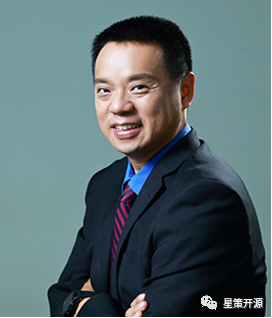

# 星策社区再添新导师！OpenTEKr创始人狄安，携手打造数智化新标杆

星策开源 2022-10-28 17:00

近日，OpenTEKr 创始人、上海开源技术协会副秘书长—狄安，正式加入企业智能化转型开源社区---“星策”。作为拥有二十多年企业级管理软件及数据分析领域的数字化应用服务的专家，狄安老师致力于开源技术在企业数字化建设中的工程化应用，近年来推动企业取得突出转型成绩。未来，狄安将作为星策社区导师继续推进社区建设发展，加速各行业数字化转型进程。

## 导师介绍

狄安，二十多年企业级管理软件及数据分析领域的数字化应用服务专家。早年任职普华永道咨询专家，担任过Sage赛捷中国区CEO，后在商业智能领及数据分析域创业，为中国市场引入各类知名BI软件如BO，Microstrategy, 和数据统计分析软件SPSS。

2019年起，创立OpenTEKr 社区，致力开源技术在企业数字化建设中的工程化应用。有译著《IT咨询指南》 

## 星策社区

星策开源社区于2022年3月成立，是由：LF AI & Data 基金会 、COPU中国开源软件推进联盟、中国信通院、腾讯、微众银行、中兴通讯、蒙牛乳业、中国工商银行、第四范式、CSDN 等多家行业领军企业及机构共同发起的国内首个聚焦企业智能化转型领域的开源社区。社区旨在汇聚转型攻坚力量，持续探索企业智能化转型方法论、优质案例、最佳实践及支撑企业智能转型的开源技术，以共享共建的形式加速各行业的转型升级。

当前，星策社区导师团队，由 LF AI & Data 执行董事 - Ibrahim Haddad博士、第四范式联合创始人 首席架构师-胡时伟、资深开源专家 中国开源推进联盟副秘书长 - 谭中意、广东省连锁经营协会技术委员会联席主席-沈欣、OpenTEKr创始人，上海开源技术协会副秘书长—狄安 五位大咖共同组成。未来，星策社区也将不断拓展导师团队，携手助力企业打造数智化新标杆。

## 寄语

OpenTEKr创始人、上海开源技术协会副秘书长狄安表示：“数字化时代，以开源技术为基础的集众智、采众长，并通过开源社区的协同创新已经成为了全球软件技术发展的主导模式。在当下中国全面发展科技的战略指引下，开源是各企业向数字化和数智化迈进不可缺少的关键要素。而通过星策开源社区，可以更好的帮助企业用好开源，参与开源，贡献开源。”

星策社区发起人、中国开源推进联盟副秘书长谭中意表示：“非常欢迎狄安老师加入星策社区，共同赋能企业智能化转型。狄安老师作为拥有二十多年企业级管理软件及数据分析领域的数字化应用服务的专家，致力于开源技术在企业数字化建设中的工程化应用，近年来推动企业取得突出转型成绩。狄安老师的加入将有助于社区共建高质量的企业智能化转型相关方法、案例和技术。”

## 最后

新时代开源的发展越来越蓬勃，越来越多的企业和个人积极拥抱开源，为开源软件插上高效的腾飞的翅膀，以开源的方式共享共建企业智能转型的方法论、案例、实践和技术，助力传统企业智能化转型，协同社区一起加速科技创新与传统产业融合发展，共同打造行业数智化新标杆。

有关星策智能化转型开源社区的更多详情，请点击「阅读原文」访问社区官网（http://startogether.ai/）。
