# Feature Store Meetup V3 回顾

## 华为商城 & 第四范式 & 众安保险特征平台建设实践

2022-06-23 10:55:00 星策社区

6月12日，星策社区主办的第三期「Feature Store Meetup」于线上开展，**本次活动由思否视频号、CSDN直播间、示说网同步支持，累计观看人次超过4500+。**

活动围绕“Feature Store特征平台的建设实践”，特邀星策社区发起人**谭中意**，分享“ Feature Store的概念与发展概况”；

华为商城算法工程师**曾中铭**，分享“华为商城特征平台建设实践”；

第四范式 OpenMLDB PMC **陈迪豪**，分享“ OpenMLDB 解决生产环境上线面临的数据特征挑战”；

安保险金融数据应用团队负责人**郭育波**，分享“众安保险金融特征中台建设”；

几位嘉宾分别从技术角度对 Feature Store 的应用实践进行全方位解读。

🌟本文根据四位老师分享的重点内容整理而成，**PPT获取请关注公众号「星策开源」并回复「0612」～**🌟

## 精彩内容回顾

### Part1：Feature Store概念与应用背景—谭中意

星策社区发起人，开源软件推进联盟副秘书长，开放原子基金会TOC副主席—谭中意，在此次 meetup 中重点介绍了 Feature Store 的概念、与发展情况。

#### 机器学习数据难题

AI System=Code+Data+Model，其中数据问题尤为棘手。数据带来的挑战主要包括五个方面1. Scale-海量的data for training；2. Low Latency-高QPS低延迟的serving；3. Data change cause model decay- world change；4. Time Travel-时序特征数据处理容易出问题；5. Training/Serving skew- 训练和预测使用的数据不一致，当然还有更多。为了解决这些数据问题，在借鉴 DevOps 领域的成功经验后出现了 MLOps 。

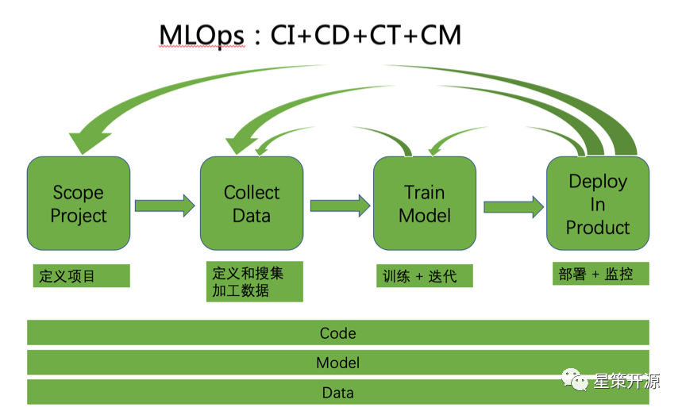

#### MLOps是什么？

MLOps 是面向机器学习领域，为了提高机器学习落地效率而出现的概念。其中涉及角色包括数据科学家和软件工程师。任务包括定义场景、数据收集和整理、模型训练和部署、持续监控和更新，包括 Pipeline 的四个部分，在整个生命周期中的每一环节都需要更快的迭代和更快的反馈。

#### MLOps 不只是流程和 Pipeline ，还包括以下的工具平台：

- 存储平台：特征和模型的存储和读取
- 计算平台：流式， 批处理特征和模型
- 消息队列：用于接收实时数据
- 调度工具：计算/存储资源的调度
- Feature Store：注册/发现/共享特征
- Model Store：模型的注册/存储/版本等
- Evaluation Store：模型监控/AB测试等

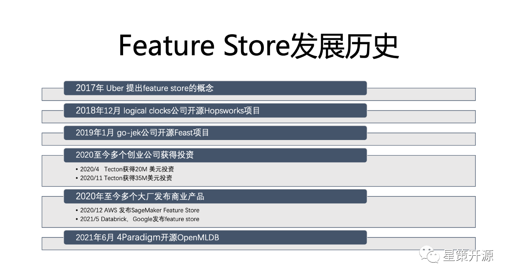

#### Feature Store是什么？

> A feature Store that allows teams to share，discover and use a highly curated set of features for their machine learning problems.--from Uber’s Blog

Feature Store 是构建、管理、共享机器学习所需要的特征的中间仓库。自2017年 Uber 首次提出后，发展至今已有多个创业公司获得投资。2020年至今，国内已有多个大厂发布了相应的商业产品和开源项目。

### Part2：华为商城特征平台建设实践——曾中铭

华为商城算法工程师曾中铭，在本次活动中主要介绍了华为商城业务背景、问题、挑战；特征平台建设目标、亮点，业界前沿观察。

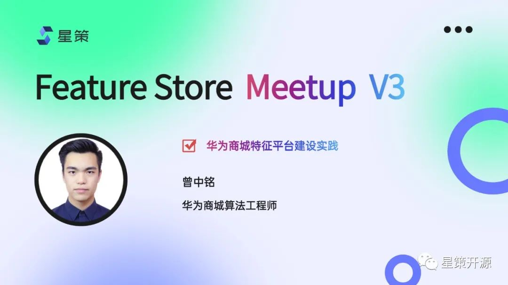

#### AI数据挑战与特征平台建设背景

AI开发中存在诸多技术挑战，涉及技术栈多，流程长。以推荐系统为例，整个推荐系统包含了数据，模型，工程三大部分，其中涉及的技术栈非常全面，流程非常复杂。其中任意一个地方出问题，轻则导致模型效果下降，用户体验受损，重则导致服务不可用，引发生产事故。

而以数据为中心的难题，是业界探索和解决机器学习落地的重点。这些难点可以分成五个大类：特征计算难、特征 Serving 难、样本生成难、特征样本监控难、特征、样本管理缺失。为了解决这五个难点，华为商城有了自己的特征平台设计目标。

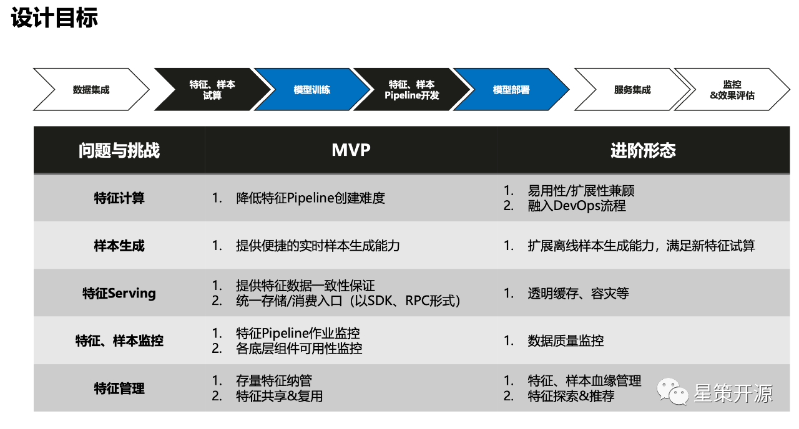

#### 特征平台设计目标

上图所示，整个特征平台规划可以为两个阶段，MVP 阶段和进阶阶段，前者着重解决从无到有的能力问题；后者在此基础上，提供更好的扩展性。举例来说，以特征计算为例，它的创建与管理对算法工程师来说，并不在算法方式本身的技术栈范围内，所以特征平台的目标就是降低整个特征 Pipeline 的创建难度，帮助算法工程师能快速的实现他们的数据验证。而在 MVP进阶阶段，则是针对比较复杂的特征计算，如何在保证平台利用性的基础上，把复杂流程通过扩展的方式加到平台上，融入 DevOps 流程。同理，针对样本生成、特征 Serving、特征样本监控以及特征管理，都分别有相应的 MVP 与进阶形态的设计目标。

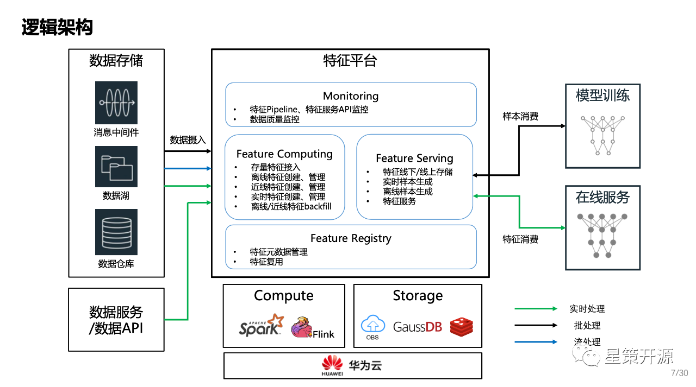

### 华为商城特征平台逻辑架构

上图是华为商城特征平台的逻辑架构，横向来看，左边是特征计算（Feature Computing），对接现有的数据中台各个存储组件以及数据服务，负责把数据从存储组件中拉取到平台上，完成特定的计算和存储。右边是特征服务（Feature Serving），对外提供消费的统一入口，当右边模型的训练，需要消费样本，这些样本会通过 Feature Serving 的模块进行查询在线服务。推理时所需要实时、高并发、低时延的查询特征，也会通过 Feature Serving 的入口进行调用。

垂直来看，首先是 Monitoring 全局的监控模块，主要负责数据 Pipeline ，特征服务本身的监控。在进阶的状态下，还会负责整个平台上所有数据的质量监控。下方 Feature Registry 是整个特征的元数据管理中心，所有平台上的特征、样本、数据资产，会在这里进行管理，然后通过 Web UI 的方式，可视化的提供给用户进行探索，方便共享和复用。

整个特征平台的四大模块，本身并不直接承载的数据计算或数据存储的工作，而是创建对应的作业，把作业交给特定的计算引擎使用。在存储方面，也只管理数据的元数据，真正数据本身的存储则交给其他云服务去做。

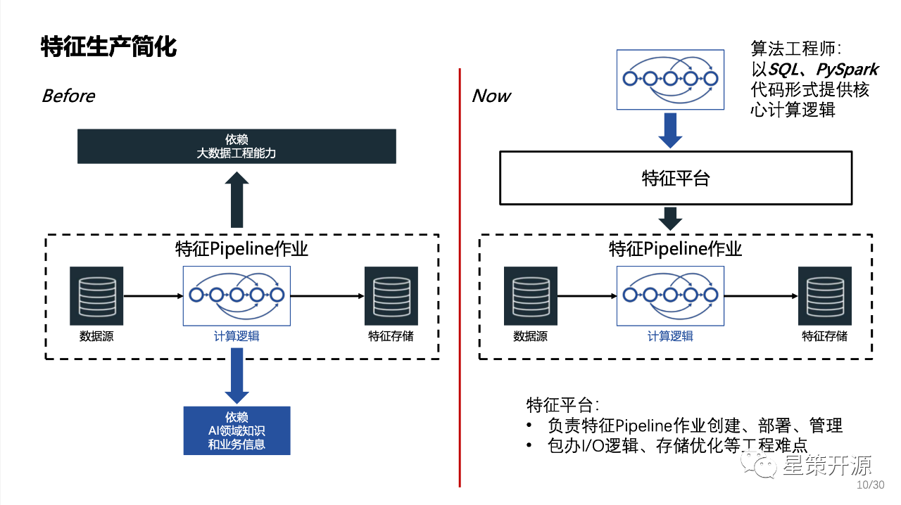

#### 特征生产的简化

特征生产的本质是建立了一个包含AI领域知识的数据 Pipeline。如上图左边所示，整个 Pipeline 非常复杂，特征生产无法通过单个角色承担: 算法工程师无法独立完成数据 Pipeline 作业创建、管理、维护；数据工程师:对AI领域知识和业务信息了解有限，跨团队效率下降。所以在特征生产简化方面的核心是如何要让算法工程师可以自助的来完成这些特征生产的工作。

右侧是加入了特征平台之后的情况。算法工程师只需要以 SQL 或者 PySpark 的形式提供核心的特征计算逻辑。平台会负责具体的特征判作业的创建、部署和管理。同时平台还承载了比较偏向工程的 IO 逻辑存储优化等等难点的解决。

因此，整个特征生产使得AI数据可以由算法工程师自产自销。同时将特征元数据统一纳管，实现资产共享复用 。做到特征 Pipeline 作业的统一管理，责任清晰。

### Part3：OpenMLDB加速企业上线智能化应用——陈迪豪

第四范式平台架构师，开源项目 OpenMLDB 核心研发与 PMC 成员陈迪豪，在本次活动中重点介绍了 OpenMLDB 是如何解决人工智能工程化落地问题，保证线上线下一致性。

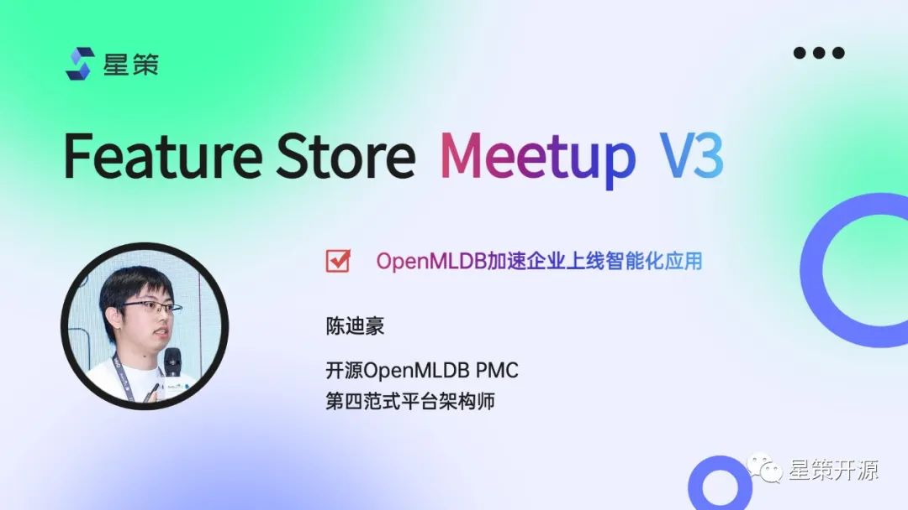

#### OpenMLDB 提供线上线下一致的特征平台

OpenMLDB 是一个开源机器学习数据库，提供了线上线下一致的特征平台。主要面向结构化数据和决策类场景的时序数据特征工程，处理时序数据和基于时间窗口的聚合函数，可以满足生产级上线需求的实时推荐系统。所解决的最核心的问题是线上线下一致性校验带来的高昂工程化落地成本问题，同时提供了毫秒级的实时特征计算。

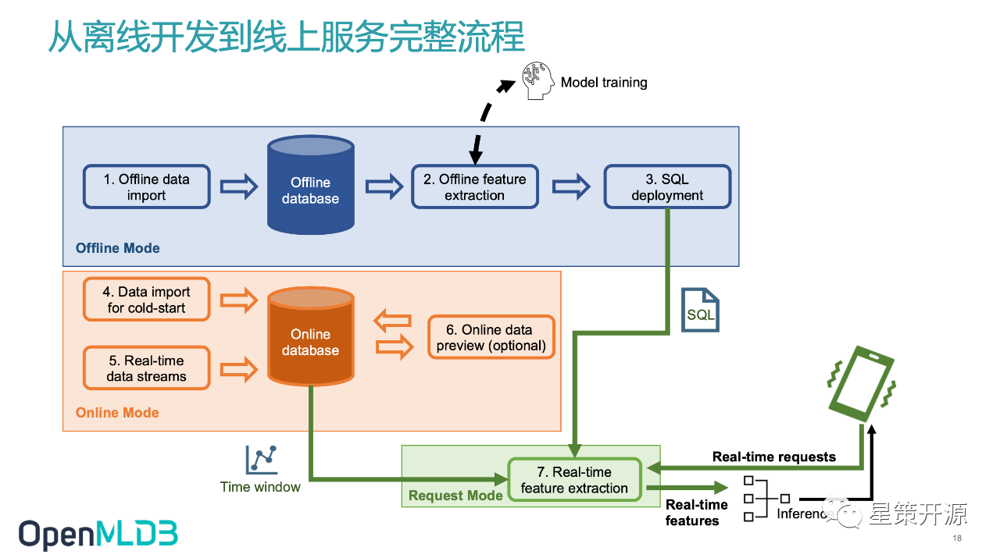

#### 离线开发到线上服务完整流程

如上图所示，在离线模式下，OpenMLDB 将离线数据导入离线数据库如 S3 或 HDFS ，然后用 OpenMLDB 离线执行引擎做离线特征计算，之后进行模型训练，得到特征结果后，将SQL做 Deploy 。在线部分将数据导入在线数据库，用 Deploy 的 SQL 做在线特征计算。最后把在线特征返回给模型，做模型的 inference 。只需在线下 做 SQL 特征脚本开发、Deploy SQL脚本以及接入实时请求数据流三步骤即可实现开发即上线的要求。目前整个 OpenMLDB 上下游支持了如下图所示的越来越多的工具。

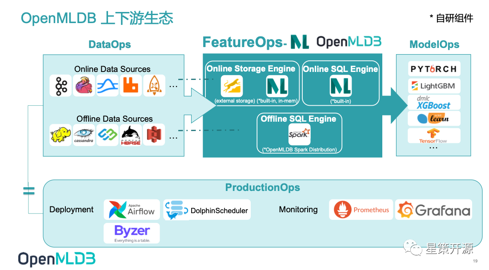

#### OpenMLDB v0.5.2：性能、成本、易用性增强

目前 OpenMLDB 0.5.2 版本从性能、成本、易用性方面都有了增强。1: 性能方面实现了预聚合技术，显著提升长窗口性能。2: 成本方面，在线引擎提供了基于内存和外存的两种存储引擎选择，两种引擎上层业务代码无感知，零成本切换。3: 易用性方面，用户自定义函数（UDF）支持了 C/C++ UDF，同时支持 UDF 动态注册，方便使用者扩展计算逻辑，提升应用覆盖范围。用户可自行根据应用场景结合自身性能需求和实时计算性能需求选择使用。

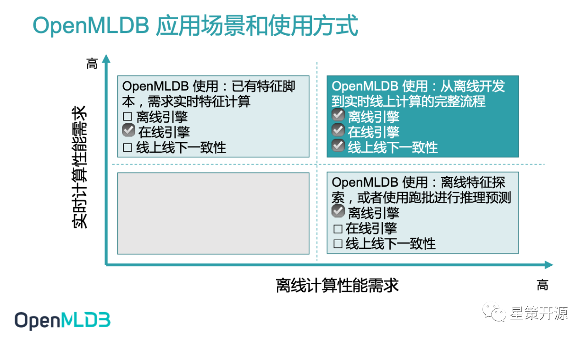

### Part4：众安保险金融特征中台建设——郭育波

众安保险金融数据应用团队负责人郭育波，在本次活动中重点介绍了众安保险金融特征中台的建设、金融特征工程简介、金融特征平台之架构设计、特征平台的内部服务详解和反欺诈特征应用。

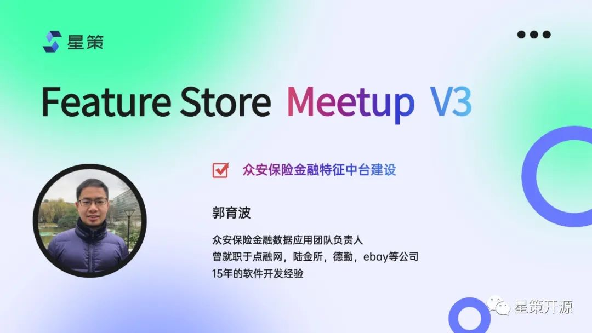

#### 众安保险金融特征中台

特征工程是将原始数据转化成更好的表达问题本质的特征的过程，使得这些特征运用到预测模型中能提高对不可见数据的模型预测精度。而我们金融的特征工程主要是为了提升对用户的风险识别能力，特征工程是数据挖掘模型开发中最耗时、最重要的一步，特征挖掘和模型的能力决定了特征工程的下限，而特征平台的能力可以提升特征工程的上限。

众安保险的金融业务主要是基于信用保证保险，为用户提供信用借贷的服务。我们的特征更多用于风险策略和模型当中。我们的特征服务是服务于线上的金融业务，需要提供实时的金融风控能力，所以特征工程是以特征中台为核心建设的，特征中台围绕稳定性、准确性、实时性、高性能、扩展性五个核心指标，搭建了基于 Flink 的实时计算引擎、使用阿里云 Table Store 的高性能存储引擎，整个特征平台通过平台化为微服务化的架构方式来进行建设。

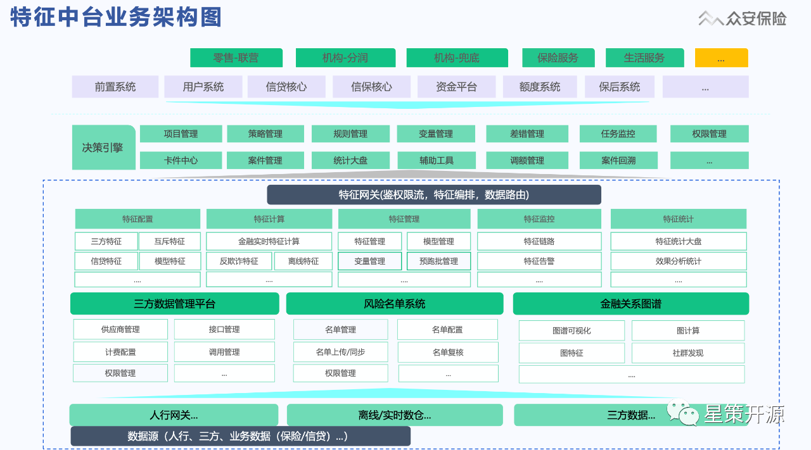

#### 特征中台业务架构

上图是特征中台业务架构，其中包含零售自营业务，渠道合作业务，以及保险中收服务。这些业务都是通过业务中台、然后进入到决策引擎以及特征网关进行交互的。特征数据服务的出入口是特征网关，通过特征网关可以完成鉴权限流，特征编排和特征数据路由。底层支撑是特征的后台管理服务，包含特征的配置功能和实时特征计算、特征监控以及特征统计。下一层是一些子系统，这些子系统不但服务于特征中台，同时也可以单独的对外提供服务，包括三方数据管理平台，风险名单系统以及金融关系图谱平台等。

#### 特征中台系统架构

整个特征中台是以微服务化构建的特征服务体系，特征数据来源主要是三方数据，征信数据，实时数据，离线数据。通过三方特征服务，特征组合服务，模型服务提供特征计算的一个风控数据系统。上游包括前台系统、决策系统以及保后系统。整个调用首先会经过特征网关进入数据接入层，之后进入特征计算层，进行相应的服务计算，最后一些需要再加工的特征会进入特征的组合层。下面是整个后台的管理层，实现特征管理的服务能力，比如说特征的管理平台，特征监控平台，特征计算平台以及调度平台。

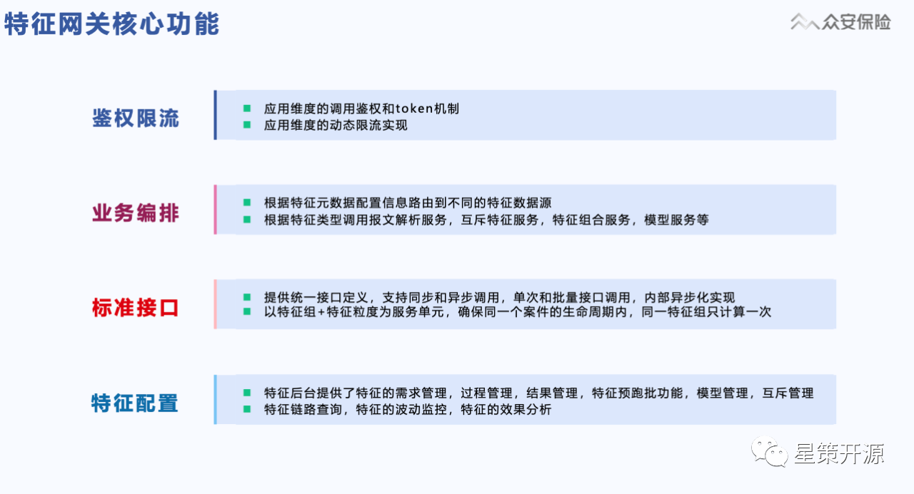

#### 特征平台未来规划

实现流批一体：实现线上线下特征的一体化，解决特征口径线上线下不一致以及开发效率方面的问题。

提供在线机器学习：特征中台结合在线机器学习，实现模型的线上化验证能力，提高这个模型迭代的效率，缩短机器学习线上化周期。

### 总结

随着机器学习在越来越多的企业部署到更多的场景中，对于数据/Feature 的管理也越来越有挑战性。Feature Store的应用解决了企业内特征的难题，保证了线上/线下数据的一致性，活动中各家的实现细节可观看完整视频回放，希望大家有所收获。

最后，欢迎大家持续关注 MLOps 与 Feature Store，加入交流群和我们一起讨论 MLOps 相关内容。