# FeatureStore meetup V4回顾｜腾讯 & 微软 & 第四范式特征平台技术解析与应用实践

2022-09-16 10:00 星策社区

> 在机器学习领域以数据为生产资料的新型生产关系中，特征的质量成为AI/ML算法效果的天花板。Feature Store 的出现可以加速推荐建模优化的迭代，简化机器学习中的特征管理和特征计算，并提升机器学习的生产力。国内已有多家公司拥有自己的技术实现，云上产品和开源项目。

> 为了共同探讨如何实现和应用好特征平台 FeatureStore ，交流建设心得，传播经验体会，星策社区特此开展了 FeatureStore Meetup 活动，目前已邀请了来自美团外卖、伴鱼、小米、网易云音乐、AWS、工商银行、华为商城、众安保险、第四范式等多家公司的技术专家参与分享，得到了广大开发者的关注和积极反馈。

> 9月4日，由星策社区主办的第四期「Feature Store Meetup」于线上开展，活动特邀请星策社区发起人-谭中意；第四范式系统架构师、OpenMLDB研发负责人-卢冕；腾讯推荐中台架构师-赵喜生；微软首席数据科学家-朱晓勇，4位大咖讲师共同探讨分享了 Feature Store 在各自项目/领域中的设计解析与应用实践。累计观看人次超过1.8w+。

🌟本文根据四位老师分享的重点内容整理而成，视频回顾见文章末尾，PPT获取请关注公众号「星策开源」并回复「0904」

## Part1：Feature Store 的背景与发展—谭中意

星策社区发起人，开源软件推进联盟副秘书长，开放原子基金会TOC副主席—谭中意，在此次 meetup 中重点介绍了 Feature Store 的背景与发展。

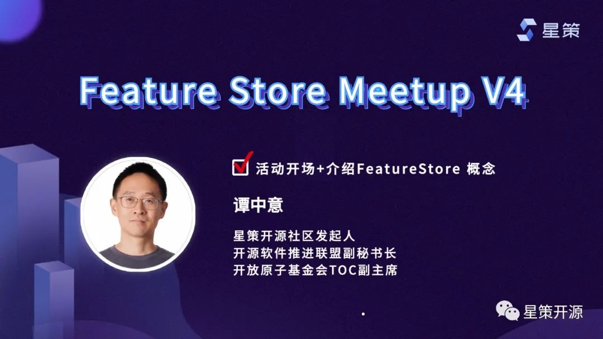

### FeatureStore出现的背景

现如今企业都面临着智能化转型的需求，其中对技术而言要做到机器学习在企业内“多快好省”的落地。然而现实是机器学习落地慢，效果不但达不到预期，效果还可能会回退。为了解决这一问题，在借鉴DevOps领域的成熟经验后发展出现了MLOps（如下图MLOps：CI+CD+CT+CM）。特征平台 Feature Store 正是MLOps中的关键基石之一，它是一个让多个团队共享、发现和使用经过高度定制的特征的平台，应用在机器学习领域中。

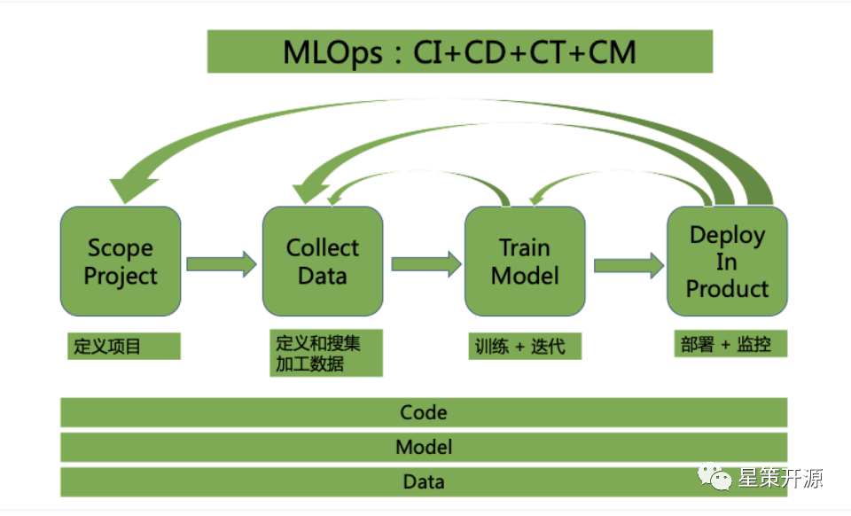

### Feature Store解决的问题

- 特性1: 同时满足模型训练和预测的需求
读取批和流式数据
同时满足Offline的大批量和Online的低延迟需求
- 特性2: 解决特征处理在训练/预测阶段不一致的问题
保证数据/ETL的逻辑在线上/线下的一致性
- 特性3: 解决特征处理的重用问题，避免浪费，高效共享

### Feature Store发展历史
自2017年 Uber 首次提出后，发展至今已有多个创业公司获得投资。2020年至今，国内已有多个大厂发布了相应的商业产品和开源项目。如本次活动中所分享的由第四范式开源的机器学习数据库OpenMLDB、及由领英&微软共同开发维护的企业级高性能开源Feature Store-Feathr等。

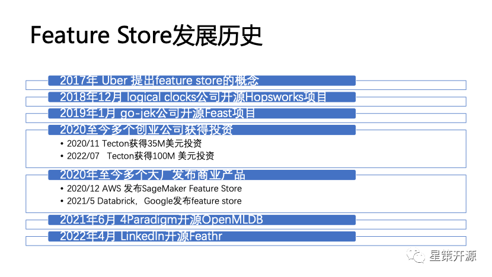

## Part2：开源机器学习数据库 OpenMLDB: 线上线下一致的生产级特征平台—卢冕
第四范式系统架构师，开源项目 OpenMLDB 研发负责人卢冕，在本次活动中重点介绍了 OpenMLDB 如何解决人工智能工程化落地问题，保证线上线下一致性。

### OpenMLDB 线上线下一致的特征平台

OpenMLDB 是一个开源机器学习数据库，提供了线上线下一致的特征平台。主要面向结构化数据和决策类场景的时序数据特征工程，处理时序数据和基于时间窗口的聚合函数，可以满足生产级上线需求的实时推荐系统。所解决的最核心的问题是线上线下一致性校验带来的高昂工程化落地成本问题，同时提供了毫秒级的实时特征计算。

### OpenMLDB整体架构

OpenMLDB 的整体架构设计是为了达到特征平台从开发到部署的流程优化目标：开发即上线 ，以此来大幅降低人工智能的落地成本。其完成从特征的离线开发到上线部署，只需要三个步骤：
步骤一：使用 SQL 进行离线特征脚本开发，用于模型训练
步骤二：SQL 特征脚本一键部署上线，由线下模式切换为线上模式
步骤三：接入实时数据，进行线上实时特征计算，用于模型推理

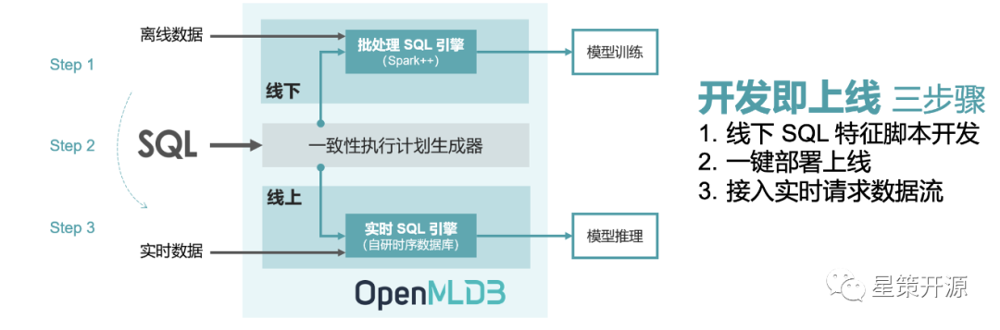

为了可以达到开发即上线的优化目标，OpenMLDB 的架构基于线上线下一致性的理念所设计。上图显示了 OpenMLDB 的抽象架构，包含了四个重要的设计组件：（1）统一的 SQL 编程语言；（2）具备毫秒级延迟的高性能实时 SQL 引擎；（3）基于 OpenMLDB Spark 发行版的批处理 SQL 引擎；（4）串联实时和批处理 SQL 引擎，保证线上线下一致性的一致性执行计划生成器。

### OpenMLDB核心特性

线上线下一致性： 离线和实时特征计算引擎使用统一的执行计划生成器，线上线下计算一致性得到了天然的保证。
毫秒级超低延迟的实时 SQL 引擎：线上实时 SQL 引擎基于完全自研的高性能时序数据库，对于实时特征计算可以达到毫秒级别的延迟，性能远超出流行商业内存数据库，充分满足高并发、低延迟的实时计算性能需求。
基于 SQL 定义特征： 基于 SQL 进行特征定义和管理，并且针对特征计算，对标准 SQL 进行了增强，引入了诸如 LAST JOIN 和 WINDOW UNION 等定制化语法和功能扩充。
生产级特性： 为大规模企业应用而设计，整合诸多生产级特性，包括分布式存储和计算、灾备恢复、高可用、可无缝扩缩容、可平滑升级、可监控、异构内存架构支持等。

### OpenMLDB当前现状

目前OpenMLDB 已开源一周年，上下游生态正不断完善，同时新版本 v0.6.0 已于（2022.8.10）发布，主要引入/增强了以下产品特性：
数据库状态智能诊断和报告工具：实验功能上线，便于问题排查
生态整合，Airflow provider package：完成和 Airflow 整合
SQL 语法增强：支持 EXCLUDE CURRENT_ROW，多场景使用，高可用性增强

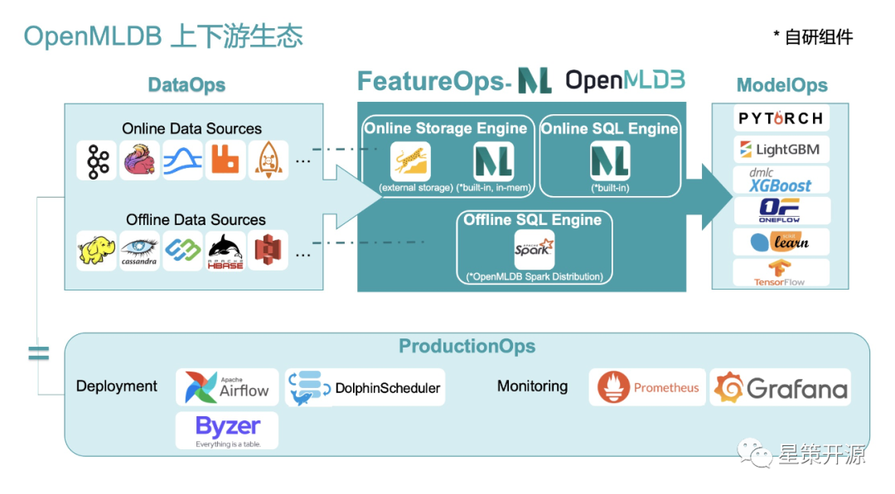

## Part3：Feature Store在金融 AI 应用中的实践—赵喜生

腾讯推荐中台架构师赵喜生，在本次分享中从平台和体系化视角出发，探讨如何建设一个高效、通用、一致的Feature Store以加速推荐建模优化的迭代。

### 理解Feature Store

在以数据生产资料的新型生产关系中，Feature Store面向算法建模和在线预测组织、管理数据，提供一致的、高性能的、实时的样本和特征服务，以驱动AI应用的高效迭代。

### Feature Store目标

提升特征工程效率，通过Feagine产品化设计优化特征工程流程，复用特征处理算子和组件，提升特征工程效率；
解决样本回放效率，在增加特征后快速生成样本并降低存储成本，加快对新增特征的实验；
保证线上线下特征一致，通过对线上特征的缓存设计以及共享Transformation Library特征处理逻辑保证线上线下特征对一致性；
解决在线服务的性能和可用率问题，通过缩短推荐在线服务的调用链路优化在线服务的延时级别来提升整体服务的性能和可用率；
保证特征和样本的质量，特征对模型对重要程度分析以及特征对质量对模型对效果影响至关重要，通过提供可视化解决方案实现对特征重要性的快速评估以及对质量变化对快速感知。

### Feature Store产品核心能力

特征元数据描述：对用户、物品、上下文等特征的元数据描述，包括特征的类型、数据类型、值的范围、数据来源等；
灵活的特征处理能力：针对离散、连续及需要做交叉的特征提供灵活方便的特征处理的组件；
快速的样本生成能力：基于算法工程师选择的特征及处理方法能够快速生成训练和验证样本；
特征分析和评估能力：在特征探索阶段对离散、连续特征进行分布值统计；针对推荐场景的目标评估不同的特征对模型的贡献值；
高性能特征KV存储和在线特征查询服务：满足业务容量的特征KV存储，能够在线通过SDK提供基于用户/物品ID的高性能特征查询服务；
离线和在线特征的一致：通过特征元数据和特征处理逻辑等的线下、线上复用和共享满足特征一致性要求；
特征质量管理机制：通过对特征分布及统计信息，以及正负样本的比例等数据变化的监控确保上游数据的质量，保证推荐结果的可信；

### Feature Store技术架构

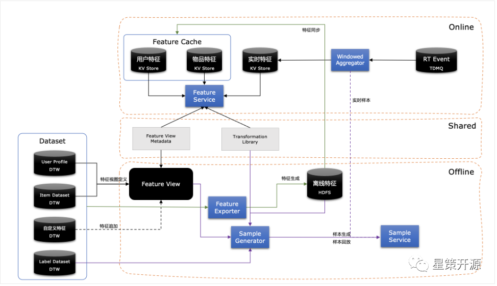

从全局视图来看Feature Store架构设计包括离线、在线和共享三部分，具体每部分的职责和特性如下：
- 离线
首先基于全量的用户和物品以及特征视图定义会生成用户、物品的离线特征；此离线特征会同步到线上到高速存储作为在线特征缓存。
另外对于特征视图定义系统将生成对应的元数据；同时用户定义特征处理逻辑也会生成相关元数据。结合离线特征、特征视图定义、特征处理逻辑以及Label数据就可以通过Feature Transformer组件生成离线训练样本。样本将根据数据的特点物理存储在多种存储中，离线生成的样本数据将可以直接用于模型训练。Sample Service会提供相应的SDK用于样本数据的读取。
- 在线
在处理在线请求时，每个请求将同时从用户特征缓存、物品特征缓存以及实时特征中获取特征，再根据当前请求对应到特征视图和特征处理元数据进行对应特征组织和转换。实时特征到生成将会由Windowed Aggregator在流式数据上进行窗口聚合处理后存入高速缓存。
- 共享
在线上和线下处理过程中特征视图和特征处理元数据，以及特征处理的Transformation Library是公用的，以此确保线上线下的处理一致性和降低处理逻辑的复杂度。

## Part4：Feathr - 企业级高性能Feature Store—朱晓勇

微软首席数据科学家朱晓勇，在本次分享中介绍了由领英与微软开发维护的开源Feature Store -Feathr 的背景、核心理念以及设计以及在不同云环境中的部署及 demo 演示。

Feathr （https://github.com/feathr-ai/feathr）作为Linux Data & AI 基金会的一员，是一个已经在领英以及微软生产环境中使用了近6年时间的一个Feature Store，并在4月份开源，于9月份捐献给LF Data & AI社区。在领英内部，几乎所有的AI应用都是基于Feathr构建。Feathr在微软与领英典型的应用包括推荐系统（例如人脉推荐、信息流推荐、工作机会推荐等），反欺诈系统（例如登录时Bot检测）等。

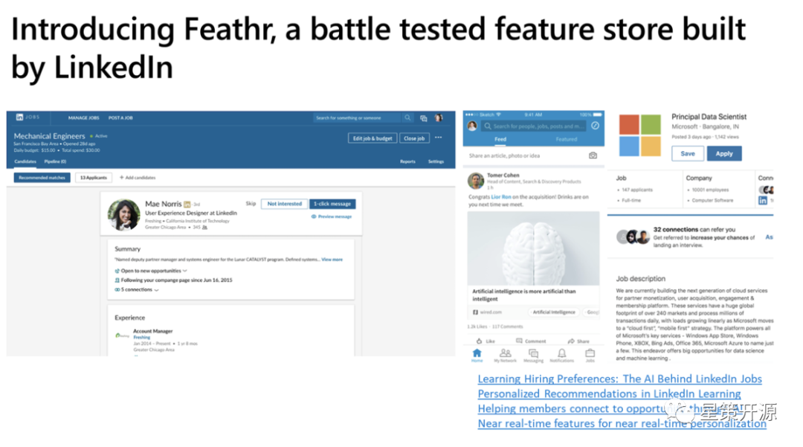

在计算机科学中有一句话，“没有什么不能通过增加一个抽象层来解决” （"We can solve any problem by introducing an extra level of indirection." - Andrew Koenig）。Feathr正是这样一个抽象层，通过对于特征工程中常见的工作进行抽象，从而极大的简化了特征工程的难度。例如，在没有Feathr feature store之前，整个的特征工程的流程如下，整体非常复杂：

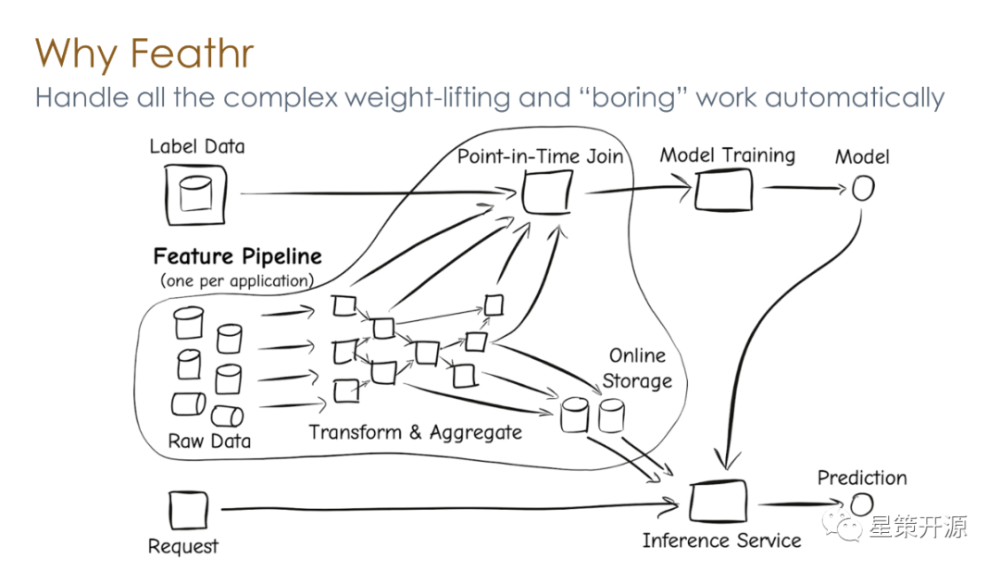

通过Feathr对于特征工程中常见的问题进行抽象和简化，那么用户就可以通过简洁的API对特征工程进行处理，把复杂的工作交给Feathr处理。常见的任务例如Point-in-time join, point-in-time aggregation等，通过一个API就可以实现，减少了数据泄露和标签泄露的问题。

对于常见的特征工程中的问题，Feathr大概分为几个部分去解决，分别是特征计算，特征注册，以及特征监控。

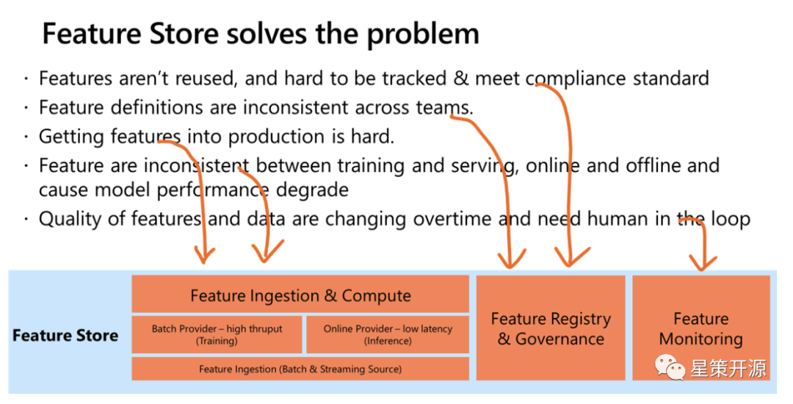

Feathr的架构如下，目前支持主流的云服务，包括Azure以及AWS。同时不依赖云上的版本也在开发中：

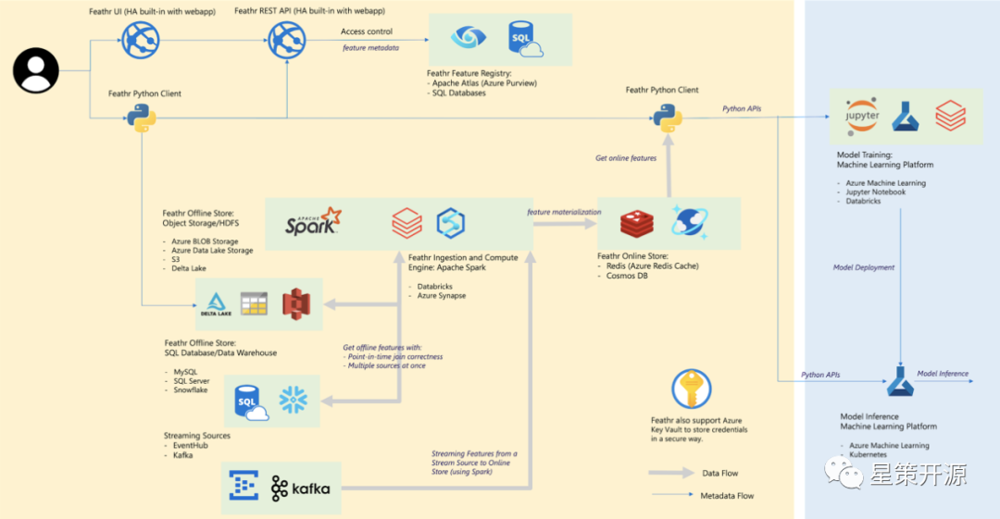

Feathr的一些核心亮点如下：

1. 通过Feathr UI来进行特征的探索和发现

    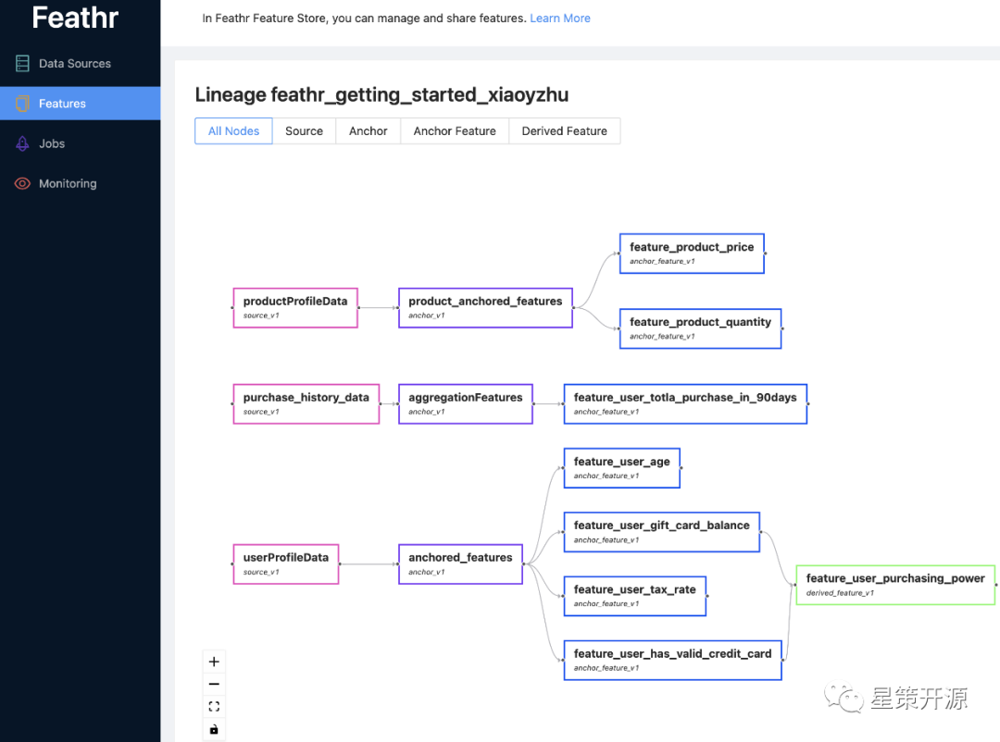

2. 通过对特征进行探索，可通过API将特征下载到本地并执行，实时计算特征

3. 在计算特征时， 支持丰富的UDF（PySpark，Spark SQL，Pandas）种类，丰富的算子支持（例如Point-in-time Join以及Aggregation），以及针对机器学习开发的类型系统（例如对于embedding的支持）。
4. 批数据和流式数据均支持特征计算，能够近实时的拿到输入的特征
5. 独有的Derived Feature功能，让特征共享以及复用更加容易
6. 企业级的特性，例如基于角色的访问权限控制（RBAC）
7. 针对超大规模数据的支持，例如十亿级别表的Join，以及复用之前计算结果，避免重复计算等。

最后给大家带来了一个Feathr的产品演示，具体细节请参见下方链接

## 总结
随着机器学习在越来越多的企业部署到更多的场景中，对于数据/ Feature 的管理也越来越有挑战性。Feature Store的应用解决了企业内特征的难题，保证了线上/线下数据的一致性，活动中各家的实现细节可观看完整视频回放，希望大家有所收获。

最后，欢迎大家持续关注 MLOps 与 Feature Store ，加入交流群和我们一起讨论相关内容。

## 视频回顾

谭中意——FeatureStore介绍+活动开场

https://www.bilibili.com/video/BV1VP4y1Z7WL?spm_id_from=333.999.0.0&vd_source=321ee5339c890965b94c8c660a674e52

卢冕——开源机器学习数据库 OpenMLDB: 线上线下一致的生产级特征平台

https://www.bilibili.com/video/BV1vK411f79g?spm_id_from=333.999.0.0&vd_source=321ee5339c890965b94c8c660a674e52

赵喜生——Feature Store在金融 AI 应用中的实践

https://www.bilibili.com/video/BV18e41137cj?spm_id_from=333.999.0.0&vd_source=321ee5339c890965b94c8c660a674e52

朱晓勇——Feathr - 企业级高性能Feature Store

https://www.bilibili.com/video/BV1DW4y1q787?spm_id_from=333.999.0.0&vd_source=321ee5339c890965b94c8c660a674e52

有关星策智能化转型开源社区的更多详情，请点击「阅读原文」访问社区官网（http://startogether.ai/）。