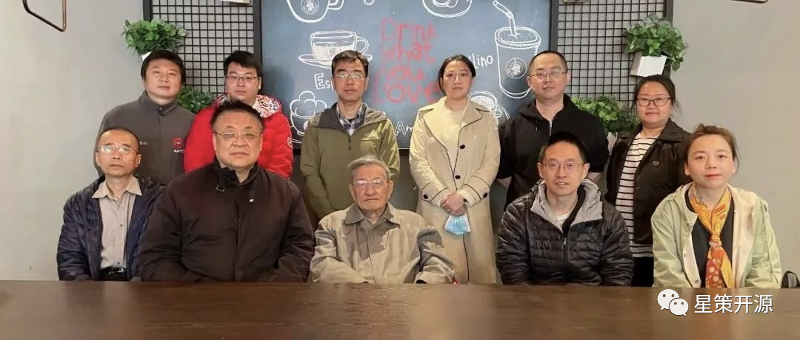

# 星策社区获中国开源软件推进联盟陆首群主席肯定

2022-04-07 14:28 星策社区

4月6日，由COPU主席陆首群主持的COPU开源软件推进联盟例会召开。会上，COPU副秘书长谭中意汇报了星策社区工作进展，获得陆首群及联盟其他成员的高度评价与一致认可。

会议认为，COPU、信通院、AI＆Data、腾讯、微众银行、第四范式等星策开源社区的发起方在各自领域极具影响力，但要真正要达到智能化转型的桥梁作用，必须多方深入研究，保持沟通畅通，及时有效回馈，优化运作机制。

同时，**会议还肯定了以“星策开源社区”为代表的开源基础设施建设创举，认为中国开源发展迅速，开源总体水平提升明显。中国开源未来发展要坚持脚踏实地，既不要趾高气扬，也不应妄自菲薄！”**
