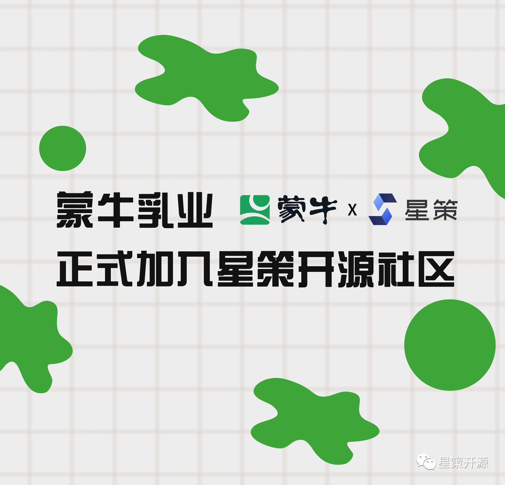

# 蒙牛乳业加入星策开源社区，携手推动企业智能化转型建设

2022-04-29 10:43 星策社区

近日，因在数字化转型领域的突出贡献，**蒙牛乳业应邀加入企业智能化转型开源社区---“星策”，将作为创始会员单位与其他会员单位共同推进社区建设发展，加速各行业数字化转型进程。**

星策开源社区于2022年3月成立，是由中国开源软件推进联盟、中国信通院、Linux基金会AI & DATA、腾讯、微众银行、第四范式、中兴通讯等多家行业领军企业及机构共同发起的国内首个聚焦企业智能化转型领域的开源社区。社区旨在汇聚转型攻坚力量，持续探索企业智能化转型方法论、优质案例、最佳实践及支撑企业智能转型的开源技术，以共享共建的形式加速各行业的转型升级。

蒙牛集团于1999成立，专注于为中国和全球消费者提供营养、健康、美味的乳制品，拥有特仑苏、纯甄、冠益乳、优益C、每日鲜语、蒂兰圣雪、瑞哺恩、贝拉米、妙可蓝多、爱氏晨曦等明星品牌。除中国内地外，蒙牛产品还进入了东南亚、大洋洲、北美等区域的十余个国家和地区市场。“十四五”时期，蒙牛立足新发展阶段、贯彻新发展理念，引领构建中国乳业发展新格局，制定“再创一个新蒙牛”的战略规划，努力将蒙牛打造成为消费者至爱、国际化、更具责任感、文化基因强大和数智化的世界一流企业。

蒙牛近几年从数字化转型价值出发，从数字化技术帮助传统企业解决实际问题入手，遵循一切业务数字化、一切数据业务化的原则，以数字化、智能化创新实现高效率、低成本运营为目的，实现在控制成本同时满足消费者的更高需求。逐渐形成了从奶源、生产、供应链、渠道再到消费者的全产业链数智化体系。

星策社区发起人、中国开源推进联盟副秘书长谭中意表示：“我们欢迎蒙牛乳业加入星策社区，共同赋能企业智能化转型。蒙牛作为传统企业数字化转型的优秀代表，这些年的转型成绩非常突出。蒙牛的加入将有助于社区共建高质量的企业智能化转型相关方法、案例和技术。”

新时代开源的发展越来越蓬勃，越来越多的企业积极拥抱开源，为开源软件插上高效的腾飞的翅膀，蒙牛及全体会员单位将开放场景和资源，以开源的方式共享共建企业智能转型的方法论、案例、实践和技术，助力传统企业智能化转型，协同社区一起加速科技创新与传统产业融合发展，共同打造行业数智化新标杆。

当下，智能化转型已成为企业顺应时代发展、保持核心竞争力的必选项。未来，星策社区将吸纳更多转型企业及合作伙伴，协同打造智能化转型繁荣的开源生态，助力更多的企业加快智能化转型进程。
