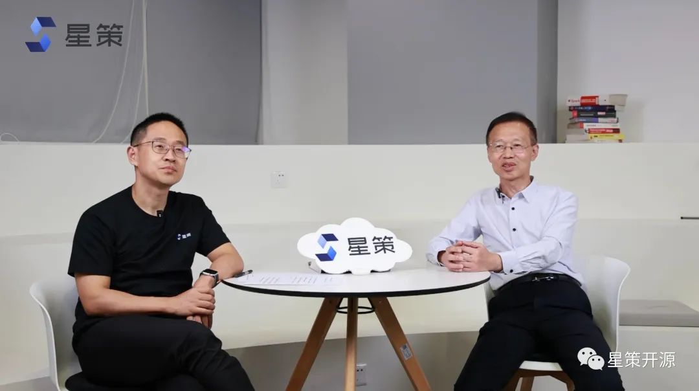
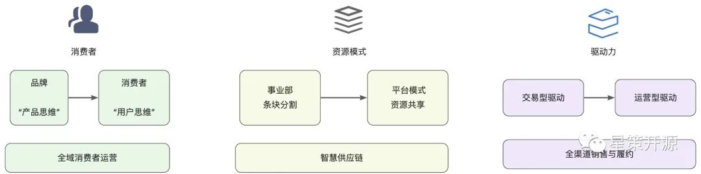
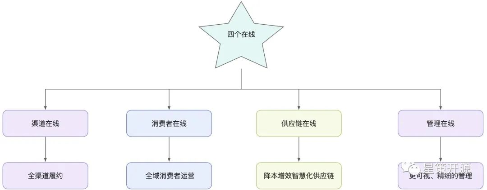
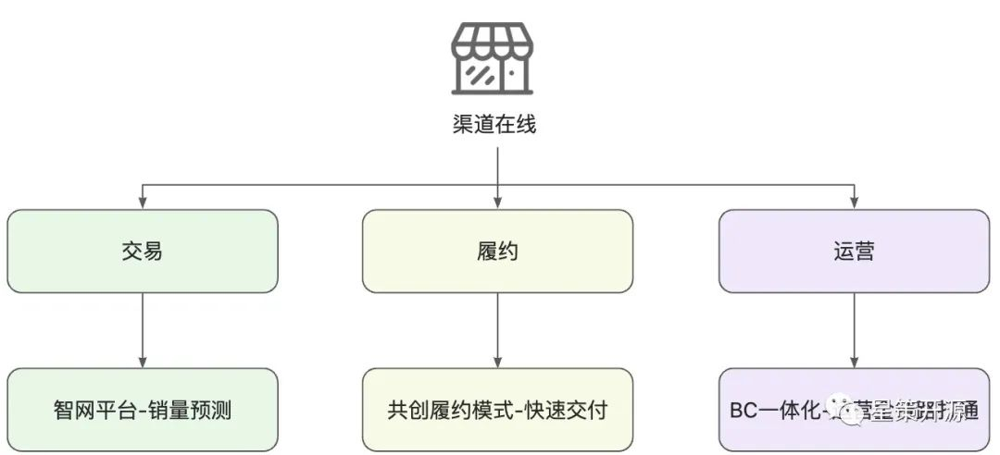
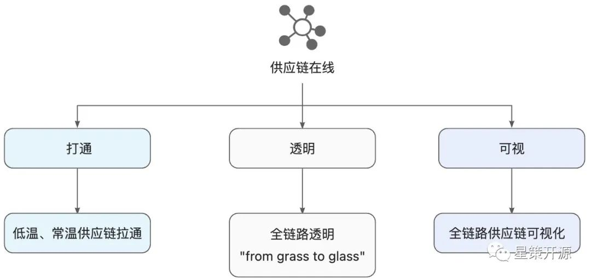
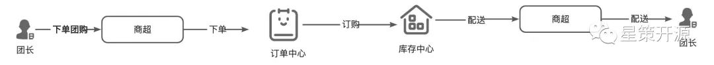
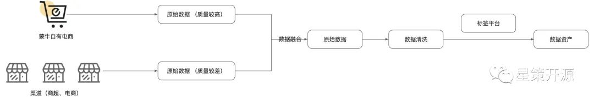
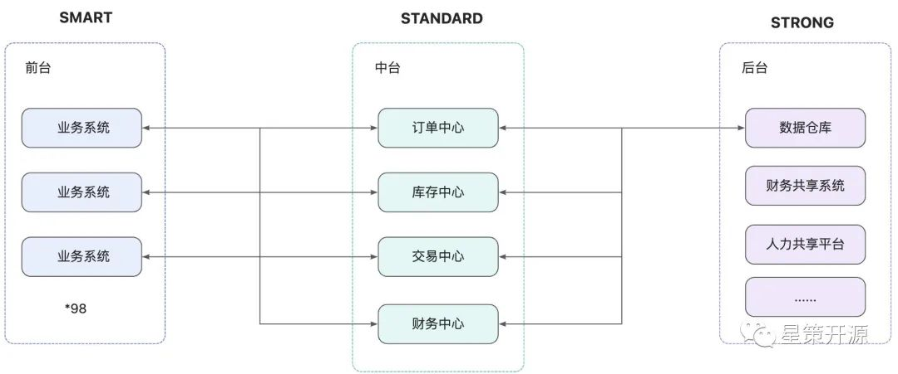

# 蒙牛前数科部总监刘瑞宝分享蒙牛数字化转型成果-星策社区大咖说第一弹

2022-10-21 19:00 星策社区

> “ 群策群力，一同探讨企业数字化转型。”

哈喽大家好，这里是星策社区举办的星策转型大咖说的第一期直播节目，我是主持人谭中意，是星策开源社区的发起人。星策开源社区是国内首个聚焦企业智能化转型的开源社区。使命是连接企业数字化、AI、开源，共建企业数字化所需要的方法论、案例、实践和技术，加速各行各业的转型升级。而星策社区大咖说是星策社区发起的一项面向企业的数字化转型的深度访谈节目。通过访谈数字化转型中的领先企业，分享他们的经验和案例，从而为当下的企业带来一些启发。

本期节目我们有幸邀请到了蒙牛的前数科部总监 刘瑞宝先生，就蒙牛的数智化转型展开探讨。

## 大家都知道蒙牛是中国领先的乳制品生产商，成立于1999 年，距今已经有20多年历史了，不久前，在中央二号对话节目上蒙牛的总裁又再次提出了再创一个蒙牛的战略规划，要把数字化转型作为蒙牛的核心战略，用五年时间再创一个新蒙牛，构建中国乳品企业发展的新格局。请问蒙牛制定了怎样的数字化转型规划呢？

为什么做转型，我们要从商业的本质去探讨。在蒙牛的角度，商业的本质有什么变化？我们发现从这么多年，商业的本质其实没有变。商业的本质就在于我们能够多卖，能够卖得更好。那既然本质没有变，那什么变了呢？

其实是商业的模式变了，消费者变了，我们的技术变了，我们的组织要求变了。

那我们看消费者现在变成了什么样子，消费者变成了一个无时无刻的需求，无处不在的需求以及它需要无所不能消费的一个习惯。

消费者变了，如果我们再不去改变原有的商业模式，可能就不能跟得上时代的发展。

那在商业模式变化的过程中，我们怎么去做转型，这就是摆在我们面前的一个课题。

那么，我们要怎么去做转型呢？我们分析了自己的一个现状，我们首先要三个转变：

1.第一个转变是整个面向消费者的转变，从面向品牌转到面向消费者，既从产品思维向用户思维转变。
2.第二个转变是资源模式的转变。以前蒙牛资源其实都是条块切割的，按照事业部去划分资源。现在我们是建立了这种平台模式，既从资源部门所有向跨部门平台化转变。
3.第三个转变是驱动力的转变。以前驱动是交易型驱动，而现在我们要变成运营型驱动，既从交易驱动向运营服务驱动转变。

那么三个转变如何实现，其实给蒙牛提了一个新的课题。蒙牛定下来要做几件事情：

1.全域消费者运营；

2.全渠道销售与履约；

3.智慧供应链；

那从这里边，其实这就引出了蒙牛提出的四个在线，四个在线就是渠道在线、消费者在线、供应链在线和管理在线。

提出“四个在线”的原因是因我们在设计蓝图的过程中，是业务为中心出发的。

如果不以业务为核心的数字化转型都是假转型。

任何的数字化转型都会触动业务、流程的变革。

## 蒙牛是出于什么考虑，从四个在线开始做起的呢？

消费者在线主要用于全域的消费者运营。

渠道在线针对全渠道的销售与履约。

供应链在线主要提出了这种降本增效的智能化柔性供应链。

管理主要是通过更精细化的管理降本增效。

## 在数字化转型过程中，渠道在线被认为是蒙牛最主要的目标之一，那么蒙牛和渠道的关系之前是什么样子的，要变成什么样子，路径又是什么样子的

其实蒙牛过去和渠道商之间是一个相爱相杀的关系。双方有共同的利益，但渠道和品牌之间也有一些小的矛盾。

那么通过渠道在线可以怎么做，做什么呢，以前的渠道主要以管理为主，而现在渠道在线主要是以赋能为主，赋能渠道商，要让渠道商有能力去赚钱，这样蒙牛才能更赚钱。

那么在这个过程中，我们抓住了三个环节：

第一个环节就是针对我们渠道的交易，如何去让这个交易扩大化，所以说蒙牛推出了一个大智网的平台，那么这一块呢，让渠道商能够在智网平台上去感知用户购买行为，进而去下单。

第二个环节就是履约，那么交易完成后，如何更快、更方便的去履约。同渠道商共创履约模式。

第三个环节是面向渠道如何运营，和渠道商共同去运营消费者。蒙牛也提出了一个 F2B2b2C 的一个全链路的打通。那么这里边我们叫 BC 一体化。

建立 BC 一体化后，形成了蒙牛的一个数据资产。当然在这个过程中，我们也遇到了很多的阻力。

最大的阻力就是来自业务和技术之间的匹配。解决这个阻力就要业务和技术结合，所以说蒙牛的数字化转型是业务去牵头，技术去赋能的一个过程。体现最强烈的是，业务的负责人一定要参与进来，并且业务的负责人能主导这个项目，那这个项目才有可能成功。

## 对于乳企来说，供应链就是生命线，供应链的协同，是涉及到各个环节。那么蒙牛的数字化转型，对于供应链的改造究竟体现在什么方面？为了什么？步骤又是什么样子？

针对供应链，我们的主要目标是降本增效。如何更快地将产品送达到消费者手中，以及从生产的角度，如何高效生产。

蒙牛智慧供应链主要体现在三个方面：

第一个就是打通，以前的供应链就是各自做各自的事情，低温的做低温，常温的做常温。现在将供应链做统一的拉通。

第二个是透明，透明不仅是供应链的透明，更是全链路的透明。蒙牛提出了一个从牧场到餐桌的一个全链路透明打通的思路，用我们的话说，就是“from grass to glass”，从牧场到餐桌，形成一个全面透明的全链路打通。

第三个是可视，全链路供应链中的每一个环节都很容易从管理端去直观看清。可以看到产品生产的位置，流程。特别是智能生产的部分，因为乳制品有个特点是保质期短。那么在这个里面，我们就要借助智能的AI设备，实现部分作业无人化；借助OT与IT融合，实现数据采集的无人化；借助流程、数据和算法，实现作业调度自动化，通过智能奶源调配，做智能的预测，去形成蒙牛的这种供应链体系。预测包括消费预测，有个项目就是针对门店的销量预测，通过销售预测实现智能补调，从而实现智能的调拨和销售计划。通过智能的销售计划，反推到工厂的生产，反推到牧场如何去供奶，这是一个全链路打通的过程。

供应链的全链路数据采集，透明化，可视化是蒙牛在整个数字化转型过程中持续追求的。

过程中也发现了很多问题，包括部分老旧系统数据不能打通，不透明。蒙牛针对性的对一些产品做了改造，按照业务的需求感知、反馈数据，通过 API 与中台对接，形成数据的融合。

奶源这块蒙牛有一个智慧牧场的项目。智慧牧场的第一步是做了精细化数采，通过脖环、耳标可精确到每只牛，按照牛的生活习惯去管理。

蒙牛现在有多个智慧牧场，通过数据的融合和打通实现牧场的智慧化管理。

智慧牧场的数据作为智慧工厂的前置数据为智能工厂提供了重要数据源。不同的智能工厂的智能程度也不一样。比如新建的灯塔工厂就是全智能。其他老旧工厂，也在分步改造中。

有了智能工厂后，我们通过我们的销售预测，去对计划调度进行一个智能的管理，形成智能计划调度体系。

然而在过程中，也有很多不确定性。在调度计划的过程中，有很多的突发情况。

从管理角度，要设计智能、柔性的管理体系。比如调整，当遇到突发的黑天鹅事件，某地突然出现了疫情，那我们的供应链就要做出针对性的适配。黑天鹅事件是机器难以预测到。

## 可以讲下，针对某地出现疫情，蒙牛是如何通过柔性、智能的供应链支持当地的奶源供应的呢

蒙牛通过数字化转型建立了统一的订单中心、库存中心，这样替换原有供应链时，我们通过蒙牛各个这样的中心能很好的切换到一个新供应链体系，这就是柔性供应链的一部分。

## 消费者在线又是指什么呢？一直以来，蒙牛都没有直接 toC 的场景，并不是特别多，更多的是通过各种渠道，各种商店来达到最终客户的。蒙牛商业模式未来将会更多的像这种 dtc（direct to customer）这种方式来转变？

蒙牛转型的过程中，我们提出了一个口号：“以消费者为天，以数据为地”。消费者在线是数字化转型过程中一个关键点。蒙牛的销售模式是以渠道为主，直接 toC 的，只占到蒙牛整体销量的 6%-7%，电商部分是蒙牛自己的。

在不能直接触达客户的场景里，我们通过第三方数据、渠道的数据，再结合蒙牛自身电商的数据以及我们 toB toC 的数据，做数据融合。

但这里有个问题是数据的质量参差不齐，自有电商的数据质量很高，渠道，尤其是卖场的数据质量不高，字段缺失严重。

如何有效利用这样的数据，就成为了关键的问题。蒙牛建立了自有的 CDP和 DMP，做好采集，拉通，尝试融合数据质量高和数据质量低的数据，互相补充。

另外，蒙牛建立了完善的标签体系以及标签中心。形成了蒙牛的标签平台，通过标签平台，能够将消费者的数据进一步清洗，形成蒙牛的消费者数据资产。

最开始采集的不是资产，只是数据，只有经过标签体系加工、治理、融合，才能形成蒙牛的数据资产。
蒙牛对于这些消费者数据加以利用，如投放场景，可以从粗犷的投放进化到精细化投放，形成数字化精准投放。根据消费者的标签，不同的人在不同时间，不同地点，不同场景看到的投放内容有所不同，这样大大提升了投放效果。

此外在运营方面也有些场景，如消费者拉新。蒙牛的消费者拉新是创新方式的。比如“电子奶卡”，“电子奶卡”可以作为礼品送给你的亲朋好友，在 消费奶卡的过程中，就自动拉新了一个新的客户。通过这种方式拉新，用户并不反感，这就是蒙牛创新的一种拉新方式。

## “管理在线”对蒙牛来说意味着什么？

“管理在线”首先是能够持续获取有用的、及时的管理数据，在这个过程中也触发了组织的变革。

在信息采集的过程中，需要组织、流程能适应这种变革。将原有的“金字塔型”组织，调整为“钻石型”组织。“钻石型”组织是以最终的场景为目的，是一个钻石的点，其他所有的点都是服务这个场景，并且可以做直接的数据采集的。

蒙牛有一个项目叫“智牛”，智牛将蒙牛所有管理的数据都进行了一个融合，所有的管理都可以通过智牛去做自动数据采集。

管理又分为执行层、决策层。

在这个过程中，针对管理，我们又提出了数据为管理赋能的新的模式，比如窜货场景，可以给管理者提供一个数据判断的依据。

另外还可以通过数据和系统，向管理要效益。做排名，做排序。在降本增效的同时，大家的劲儿能往一处使，并且让大家知道，转型做好了，能获得什么。同时也是管理信息的拉通透明。

## 感谢刘总介绍“四个在线”，那么这四个在线是靠着蒙牛内部的技术团队，通过双中台的技术架构来实现的，能简单介绍下吗？

中台是一个良药还是一个苦药，是要根据企业现有的状况。中台其实不是一个平台，是一套方法论开始，到组织变革，到流程变革，建立完善的体系后，才是平台。

我们说到前台和后台，针对前中后三台，用三个S分别可以定义他们的特点，前台是接触到业务的部分，用 SMART 敏捷原则。后台要建立一个足够 STRONG 、稳定的后台。而中台是在两者之间进行连接，要解决 SMART 到 STRONG 的矛盾，中台使用 STANDARD 标准建立各种标准，形成我们统一的能力复用。

蒙牛最开始也没有中台，经过盘点，蒙牛在役的业务系统有 98 个。业务系统独立、不打通的话，业务间没有联系，要联系起来就要改造原有系统，做不到。

因此我们在业务系统之上抽象了业务中台，形成共性的一些中心。比如订单中心、库存中心、交易中心、财务中心等，提供了丰富的 api，让各个系统可以很好的对接，让后台能直接通过中台去对接其他系统。一个后台不需要对接98个系统，那就非常麻烦了。

讲到数据中台，是在业务中台建立到一定程度后，需要数据做融合拉通。我们需要一个数据中台既可以管理数据，同时又能对外提供服务。

数据中台最核心的功能就是要建立统一数据采集平台，这就相当于建立数据集成中心，进行数据统一的管理。平台本身进行数据分层分域管理，蒙牛数据中台分了三层：垂直数据层接入了原始数据不做修改，公共数据层按数据域进行数据融合治理，萃取数据层根据业务需要形成可发布的数据资产，以形成可编排的应用。

业务中台可以为数据中台提供数据，消费数据，业务中台提供原始数据的同时消费拉通加工后的数据资产。数据中台把业务中台和其他途径获取的数据进行统一融合形成数据资产，业务中台、数据中台一体化，形成了有机的互动。

## 蒙牛的数字化转型从哪里开始的？取得了哪些有益的成果？对蒙牛的业务产生哪些转变？

第一个成果，蒙牛数字化转型最大的成果就是业务和技术间形成了良性的融合。从前技术只是被动的响应业务，现在技术和业务是统一的一体。

第二个成果，形成了能力的复用。蒙牛在降本增效的过程中形成了各个中心，包括前面提到的订单中心、库存中心、会员中心等，能积极的去响应业务。

举个例子，我们有个业务单元，要上线一个小程序中心，通过我们的业务中台形成中心能力，只用一周的时间就完成了所有功能的发布上线。

第三类成果，就是形成了很多的应用。比如智慧牧场，不仅有数据的智能化采集，更有牧场间的数据融合。

可以智能预测奶牛的乳量，发情期等。

智慧工厂。灯塔工厂叫黑灯工厂，可以没有灯，通过全智能的传感器去进行智能管理、评判。新建设的工厂引入了数字孪生，同时有一个虚拟的工厂和一个实际的工厂。

工厂从奶源的检测开始，到最后的打包封装，全都是智能，自动，无人化的。

面向消费者的成果就更多，比如通过消费者标签做消费者全生命周期运营，做智能预测、补调，智能生产，智能奶源资源平衡。门店销量预测准确率达到 70+%，大量降低成本，减少库存，增加周转。

## 有哪些经验是可以给其他企业参考的吗？

这里谈不上经验，我可以谈谈蒙牛的做法，数字化转型首先是不要人云亦云，一定要明白企业进行数字化转型的目的是什么，是有更新的商业模式，还是为降本增效，更好的销量。有目的后，转型才有落脚点。

1.不要只做技术的数字化转型，而是让技术赋能业务的转型，这才是真正的数字化转型。

2.蒙牛数字化转型有一个提法叫做“先开枪后瞄准”，转型过程中有时候看不清，但我们还是尝试做一下，开枪偏了，下一次会瞄得更准。数字化转型需要迭代。

3.拥抱开源，开放场景，与技术领域供应商共创，同时在前进过程中包容挫折，不断迭代。

4.数字化转型是一个长期的过程，马上看到收益不现实。需要管理层从战略层面对数字化转型进行大力支持。转型的过程一定要立足自己，考虑长远，不断迭代。祝大家都能找到最适合自己企业转型的路径。

有关星策智能化转型开源社区的更多详情，可点击「阅读原文」访问社区官网（[http://startogether.ai/](http://startogether.ai/)）。
