# 企业智能化转型meetup回顾

## 开源BI & AI助力企业转型之旅三阶段

2022-06-01 15:57:00 星策社区

2022年5月22日，星策社区携手微众银行、第四范式、中兴通讯等共建单位的技术专家们，共同召开社区首届“企业智能化转型meetup”。本次活动向大家介绍了如何利用开源BI & AI技术，帮助企业完成信息化—数字化—智能化转型三阶段，搭建自己的BI、AI平台，并提升AI模型性能，降低企业成本。

🌟本期 Meetup 嘉宾分享PPT获取方式：***关注公众号「星策开源」并回复「0522」***

## 精彩内容回顾

### Part1：开场+企业数字化转型旅程的三个阶段——谭中意

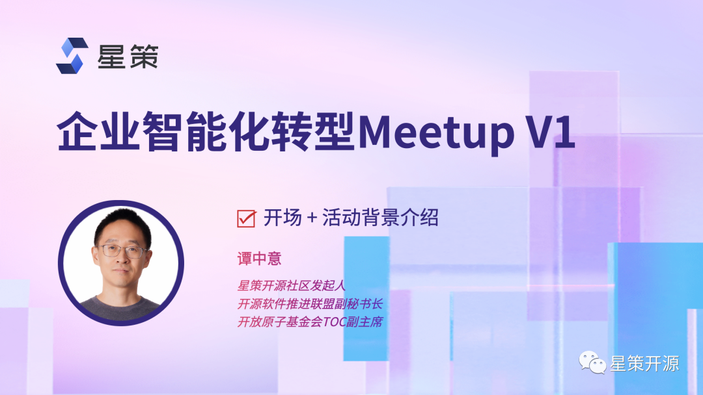

企业数字化转型的目标是保持企业的持续增长，结果是要把企业转变成为能根据市场变化而不断进化和快速迭代的企业，这个转变的过程称之为企业数字化转型。现如今，“转型”已经变得非常紧急和重要，他已经不再是选不选和干不干的问题，而是干得快和慢、好不好的问题，是决定未来企业核心竞争力的问题。其中，智能化转型是企业数字化转型的高级阶段。

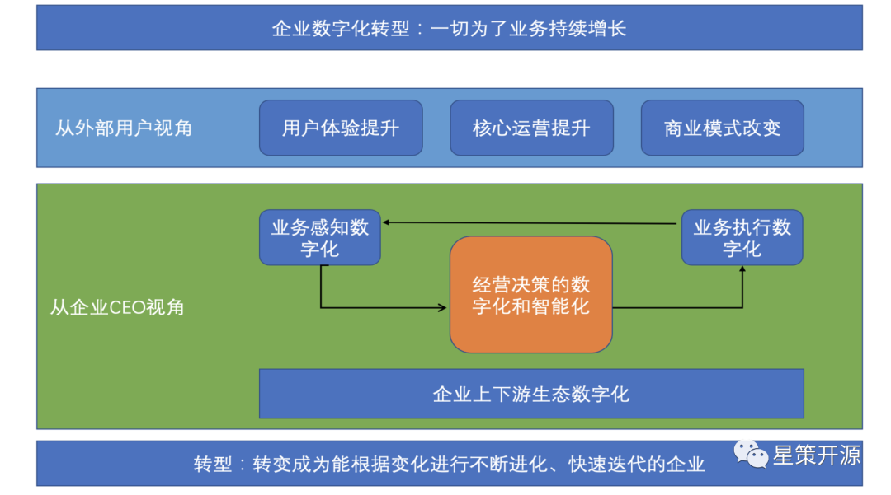

#### 什么是企业智能化转型？

如上图所示，转型的目标是为了业务增长。从外部视角来看，企业进行智能化转型之后，用户体验、核心运营都将提升，商业模式也会进行修改。从内部企业CEO的视角来看，企业的业务感知变得数字化，业务执行也变得数字化，而最关键的是企业经营决策也要变得数字化和智能化，另外还有企业的上下游生态也需要随之变得数字化。这些数字化带来的结果就是转型，让企业转变成为能根据变化而不断进行变化、进化和快速迭代的企业，这个过程就是企业的数字化转型。

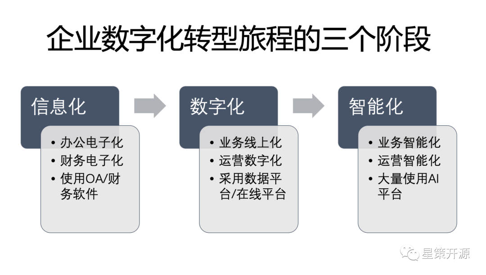

#### 企业数字化转型的旅程的三个阶段

一般来说，企业数字化转型的旅程分为三个阶段，即信息化、数字化、智能化。分开来看，第一阶段信息化，就是传统的办公电子化，财务电子化，这个阶段的特征是使用大量的OA和财务软件。第二个阶段数字化，它的特征是业务的线上化，运营的数字化，它采用了大量的数据平台和在线平台。第三阶就是智能化，这个阶段企业的业务会智能化，运营智能化，企业会大量使用各种AI平台。

而通常情况下，当企业完成了信息化，下一步将开始搭建BI系统，将要对接各种数据源，形成各种可视化报表。其中，如何快速搭建一个BI系统，可以参考使用星策社区开源项目Data Sphere Studio。之后，当企业建完BI系统开始搭建AI时，将面临AI落地过程的挑战与难题，如何做到AI的多、快、好、省的开发和上线？可以参考使用星策社区开项目OpenMLDB。最后，在AI上线后，面临着多种机器资源、AI模型，想要提升其性能、降低成本，则可参考使用星策社区开源项目Adlik，让AI服务更省、更快、更优，以此加速企业智能化转型。

### Part2：企业数字化转型，从大数据平台开始——Andy

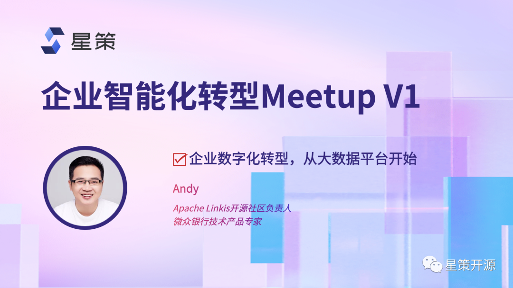

微众银行作为数字银行，所提供的服务都是在互联网上进行的。因此，作为数字银行，微众的数字化思路尤为值得参考。从几年前，国家就一直在追求企业怎么去做数字化，怎么去做数字经济，尤其是在十四五规划以来的话，数字经济已经是非常明确的发展主要目标。而今天，怎么去推进整个产业的数字化转型，怎么去做数字化，用一个比较通用的模型，5W1H来思考几个话题，到底企业的数字化转型是什么？为什么要数字化，现在我们在什么阶段？应该在什么场景去做？以及哪些企业？怎么去做？

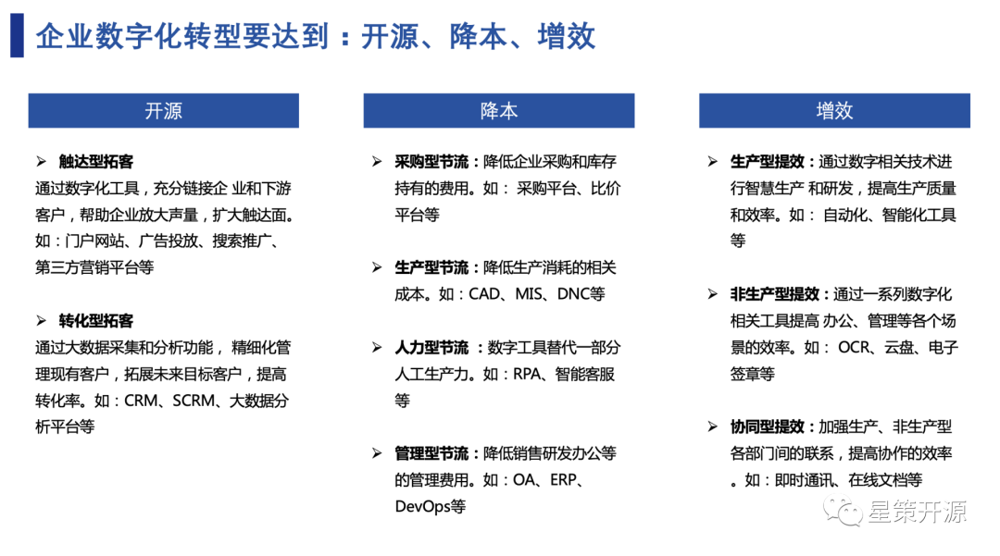

- What：什么是数字化转型？
数字化的转型主要就是用数字化技术与业务进行有效的整合，在与一些业务流程跟产品改造完毕之后，能够做到开源、降本、增效，甚至做到新的商业模式产生，这种数字化才算是成功的。

- Why：为什么要做数字化？
数字化转型最终目的是开源、降本、增效。开源就是开源节流的开源，需要关注怎么去创收，通过数字化的方式去触达更多的客户。降本，则需要关注怎么去使用新技术节约成本。增效，简单来说就是使用自动化的协同工具提升工作效率。

- When：什么阶段适合？
不同企业的不同阶段都是有很大差异的，建议在主营业务稳定的时候，立即启动数字化转型的探索。

- Where：什么场景适合？
一般来说，先从增量的业务开始做，因为这是一个探索和尝试的过程，一旦增量的业务比较稳定做好了，再迁移到核心业务。

- Who：哪些企业需要数字化？
其实，所有的企业都需要做数字化，哪怕是中小微企业，甚至个人工商户，都可以通过使用数字化工具，大幅度提高企业的效率。

- How：怎么去做？
从技术方面来说，需要选择适合的技术路线和合作伙伴。术业有专攻，目前市场上很多有成功经验的合作伙伴，企业需要挑选符合自己的合作伙伴，共建数字化系统。除了寻找合作伙伴以外，还需要投入人力物力进行学习。

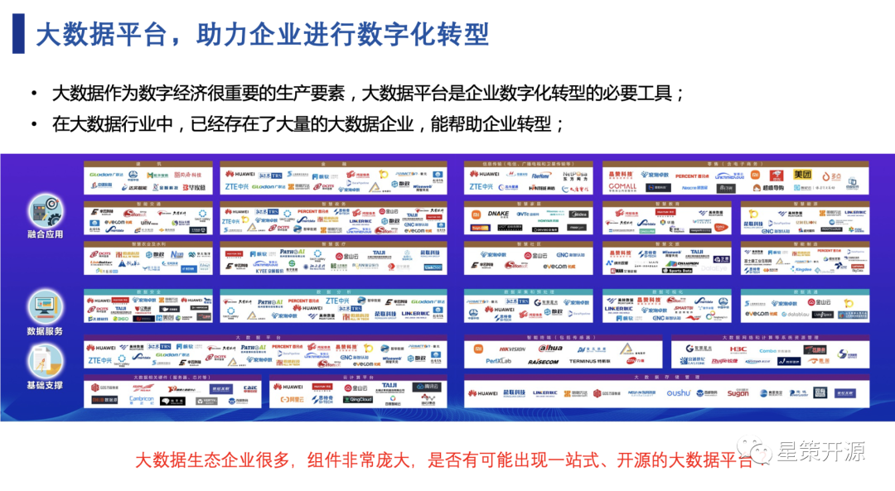

在转型过程中，无论无论各个企业怎么做转型，数据的处理都是非常重要的，大数据平台也成为了企业数字化转型的必要工具。在大数据行业中，已经存在了大量的大数据企业，能帮助企业转型。而目前看到很多一站式大数据平台，大多数厂商付费所提供的，像开源的一站式大数据平台在当前市场上是非常少的。微众作为一家数字银行，更加聚焦于一站式的开源大数据平台，将微众所用的大数据平台WeDataSphere开放出来，为整个行业开源提供了一站式、金融级、全连通、开源开放大数据平台套件。

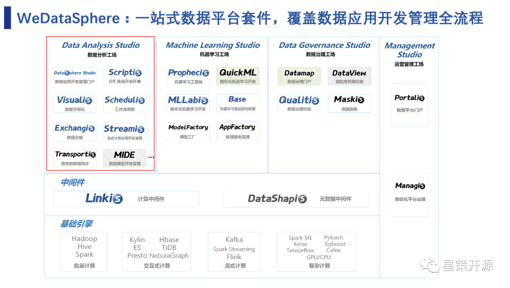

上图是WeDataSphere的整体框架，底层运用的是外部的基础引擎，中间通过中间件linkis、DataShspis连接到最上层的各个应用，这些应用包括了几个方面，分别是数据的分析工厂、学习工厂，还有数据的治理工厂，可以满足了绝大多数的应用场景，以及最右侧的一些数据管理工厂。

聚焦于图片左上角，DataSphere Studio是应用开发集成框架，它可以集成目前所有的组件，是一个管理框架。Scriptis支持脚本IDE开发环境，它支持Spark还有SQL等等主流的脚本。Visualis是可视化的工具，现在已经集成到DSS的门户里面了，可以通过拖拉的方式来实现可视化，目前它支持了很多种的图表、可视化的大屏、水印、数据质量校验等等的一些基础功能。接下来还有数据调度的Schedulis、数据交换Exchangis、流式计算应用开发管理Streamis、以及跨集群数据同步Transportis和数据模型开发管理MIDE等。这些组件最后整体形成了如今的大量数据分析的平台。

现如今，WeDataSphere的沙箱环境试用企业超过1800家，自行搭建试用/上生产的企业超过800家，涉及到金融、互联网、通信、制造、教育等众多行业；典型用户如电信天翼云、平安保险、交通银行、Boss直聘、蔚来汽车、华中科技大学国家高性能计算中心等。

### Part3：OpenMLDB加速企业上线智能化应用——卢冕

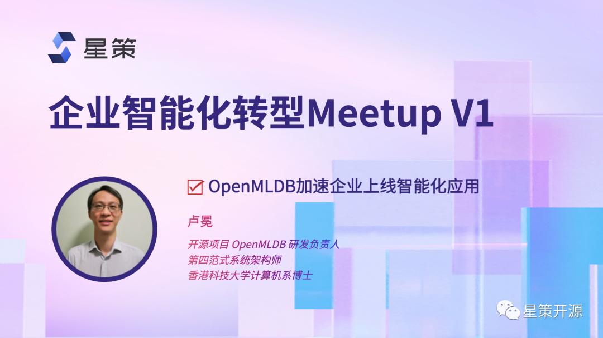

智能化转型离不开AI的转型。在AI转型过程中面临着诸多问题与挑战，比如如今的市场上，95%的时间都花在数据上，但市面上如此繁多的与数据相关的开源软件，像hadoop，Mysql等等，却并没有完全解决人工智能落地的工程挑战。在这些挑战中，最关键问题往往是围绕着数据和特征的问题。如何解决特征问题，加速企业上线智能化应用呢？

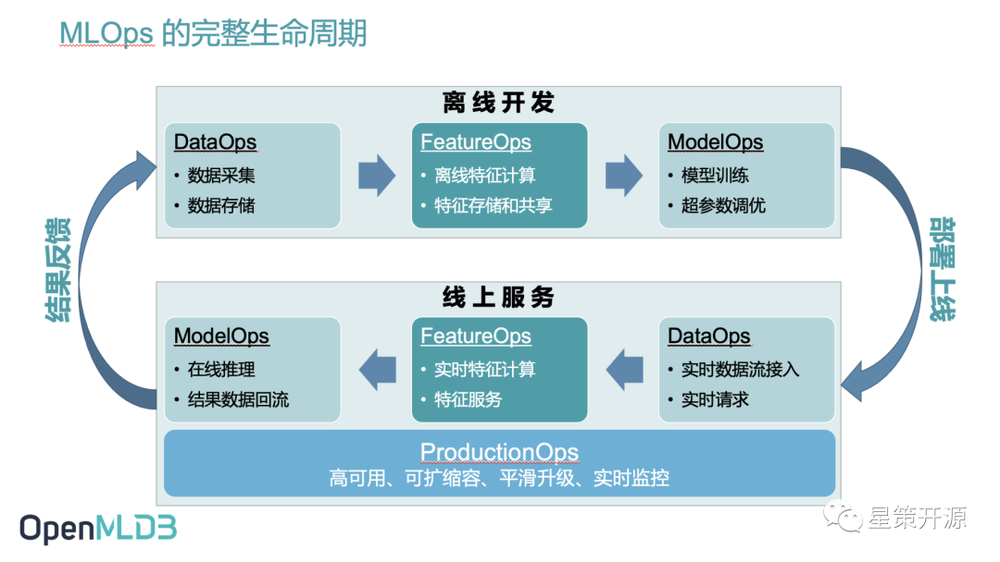

上图是机器学习应用从开发到上线的整体流程，可以看到，MLOps生命周期会分为离线开发和线上服务两个相对独立的流程。在这每个流程中都可能会经历信息的载体从原始的Data到Feature一直到最后Model的转变过程。而OpenMLDB正是解决了中间Feature部分的难题，比如如何解决线上线下一致性校验带来的高昂工程化落地成本问题。

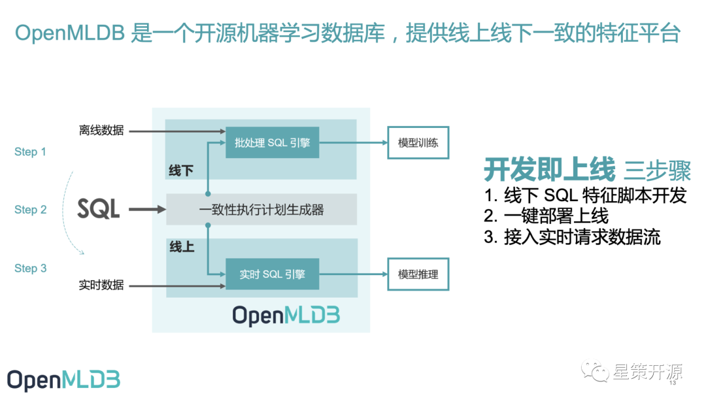

OpenMLDB 是一个开源机器学习数据库，提供线上线下一致的特征平台。如上图所示，从最外围的角度看，OpenMLDB有一个很显著的特点，就是把线上线下的编程语言统一成SQL。这样不管是离线开发，还是最后线上，所有特征的定义表达，以及计算表达，都通过统一的SQL去描述，只要数据科学家能把特征用SQL表达出来，就可以在OpenMLDB里同时做离线开发和上线，达到开发即上线的目的。

从OpenMLDB内部来看，包含线上和线下两套处理引擎。线下是一套批处理的这个SQL引擎，基于Spark做了源代码级别的优化，让他能更好地处理特征计算的逻辑。而线上基于低延迟、高并发高可用的需求，从零开发了一个时序特征数据库，并针对这个时序数据去做优化的。保证了两个引擎之间的线上线下一致性。中间的执行计划生成器，是把数据科学家定义的SQL转换成线上和线下具体的执行计划，同时天然的去保证这个执行计划的这个一致性。最终达到了开发及上线的目的，省下了大量的人力成本，很好的解决了线上线下的一致性问题。

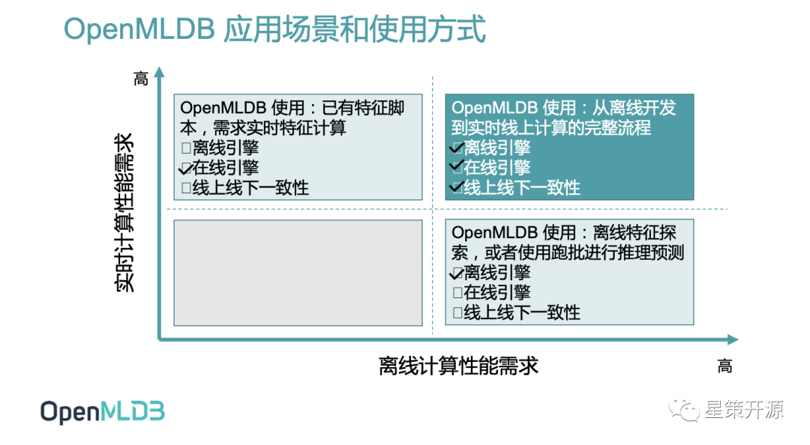

实际上，OpenMLDB也有很多的使用方法，如上图，一些公司在业务刚开始的时候，还没有上线需求，可能就用Python开发一下。但随着业务的增长，如果开发的脚本需要上线，就可以使用OpenMLDB全流程使用方式，即使用离线引擎、在线引擎，同时充分满足线上线下一致性，达到从离线开发到实时线上计算的完整流程。另外在社区也看到一些用户只使用OpenMLDB的在线引擎，比如已经有特征脚本了，但这个特征脚本在以前的在线引擎情况下满足不了需求，就可以把它迁移到OpenMLDB上。另外还有一部分用户，可能没有上线需求，或者说他没有这个实时性的上线要求，这种情况下，他其实可以用OpenMLDB的离线引擎，用Spark发行版做特征计算，也会算的比Spark社区版更快。

### Part4：Adlik 让AI服务更省、更快、更优，加速企业智能化转型——袁丽雅

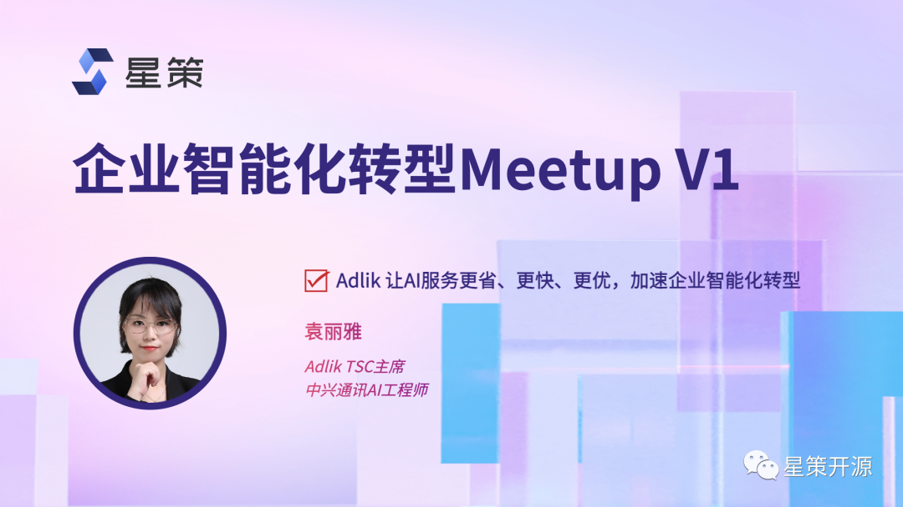

众所周知，人工智能的两个重要阶段，包括离线训练和在线推理。其中训练阶段可以分成两个步骤，一是数据采集，预处理以及打标签的过程，也可以通过像OpenMLDB这样的开源项目，来实现相关实时计算。通过这些数据可以训练出能够达到最终训练效果的模型，然后再把这个模型部署到正式的生产环境当中去。二是推理阶段，它的整个流程看起来好像是简单很多，好像只要把训练好的模型部署好，跑起来就行，但实际上，这个阶段也是有很多坑要踩，同样面临很多挑战。所以推理阶段的挑战，也是AI整个模型落地的挑战。

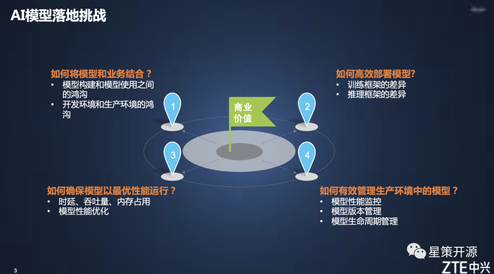

如上图所示，AI模型落地的挑战其实包括四大方面，如何将模型和业务结合？如何高效部署模型? 如何确保模型以最优性能运行？如何有效管理生产环境中的模型呢？针对以上四个问题，中兴提供了Adlik的解决方案。

Adlik是一个深度学习推理加速工具，可以将深度学习模型从训练完成，到部署到特定硬件并提供应用服务的端到端工具链，实现模型从研发状态到生产应用环境的高效切换。同时，他也可以与多种推理引擎协作，提供灵活的模型加速、部署、推理方案，助力用户构建高性能AI应用，帮助企业在落地模型时达到更省、更快、更优的效果。

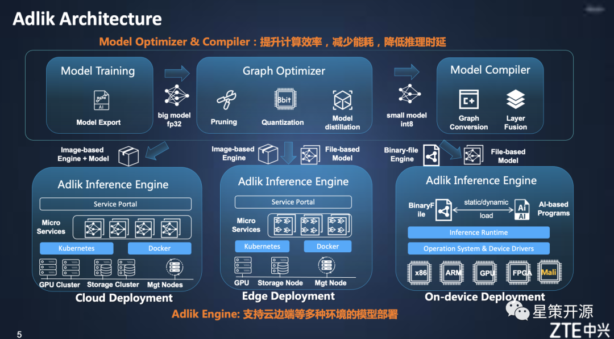

上图是Adlik的架构图，主要分成两个大的部分，一是模型的优化器以及编译器的部分，主要功能是提升模型的计算效率以及减少能耗，最终降低模型在部署环境当中的推理实验。另一部分，就是推理引擎，能够支持云边端等多种环境下的这个模型的高效部署。

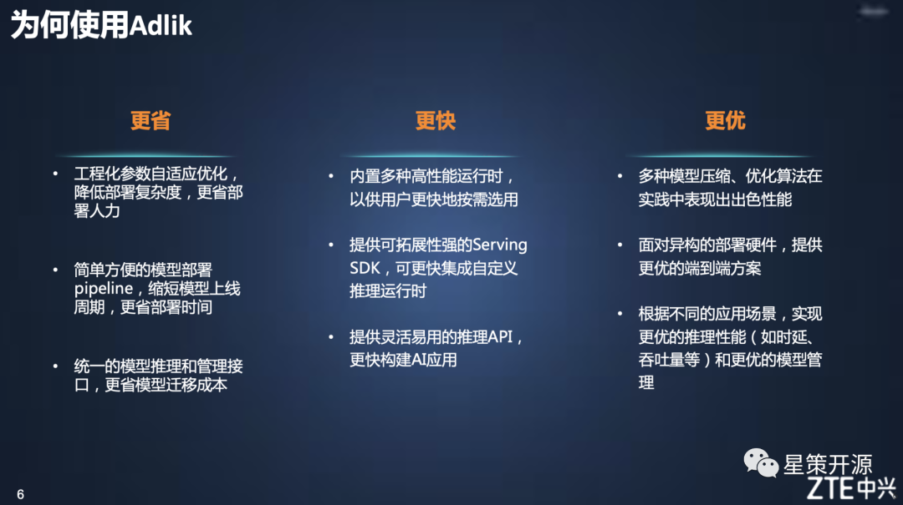

#### 使用 Adlik 可以让企业更省、更快、更优的落地AI模型

- 更省：Adlik能够实现工程化参数的自适应优化，降低部署复杂度，达到部署人力的节约。它还提供了一个简单方便的这个模型部署pipeline，大大的缩短模型上线的周期，节省了部署的时间。另外，它提供了统一的模型推理以及管理的接口，节约模型迁移的成本。
- 更快：Adlik内置了多种高性能运行时，以供用户更快地按需选用。其次，它提供了可拓展性强的Serving SDK，可以更快集成自定义推理运行时。最后，它提供了灵活易用的推理API，能更快构建AI应用。
- 更优：Adlik可以将多种模型压缩、优化算法在实践中表现出出色性能。面对异构的部署硬件，能够提供更优的端到端方案 。并且能够根据不同的应用场景，实现更优的推理性能（如时延、吞吐量等）和更优的模型管理。

### 总结

随着企业对转型的需求日益强烈，转型过程中的BI & AI工具的选择将变得尤为重要。本次活动所介绍的三个开源项目，很好的解决了企业转型过程中面临的诸多问题与挑战，各项目的详细技术细节欢迎观看活动「视频回顾」了解。

同时，为了持续探索企业智能化转型方法论、优质案例、最佳实践及支撑企业智能转型的开源技术，星策开源社区还将继续举办智能化转型相关活动，欢迎关注此群。

