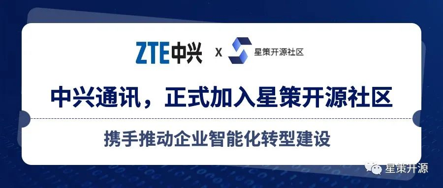

# 中兴通讯加入星策开源社区 携手推动企业智能化转型建设

2022-04-14 17:31 星策社区

近日，**中兴通讯正式作为创始会员单位加入到企业智能化转型开源社区---“星策”。中兴将携手社区其他成员，共同推进社区建设发展，加速各行业智能化转型进程。**

星策开源社区于2022年3月成立，是由中国开源软件推进联盟、中国信通院、Linux基金会AI & DATA、腾讯、微众银行、第四范式等多家行业领军企业及机构共同发起的国内首个聚焦企业智能化转型领域的开源社区。社区旨在汇聚转型攻坚力量，持续探索企业智能转型“方法论”、优质案例、最佳实践及支撑企业智能转型的开源技术，以共享共建的形式加速各行业的转型升级。

中兴通讯是全球领先的综合通信信息解决方案提供商。为全球电信运营商、政企客户和消费者提供创新的技术与产品解决方案。公司成立于1985年，在香港和深圳两地上市，业务覆盖160多个国家和地区，服务全球1/4以上人口，致力于实现“让沟通与信任无处不在”的美好未来。

ADlik 是中兴通讯发起的首个聚焦机器学习模型推理阶段的开源项目，ADlik宗旨是使机器学习模型能够高效地运行在多种部署环境下，提升模型的推理效率，减少时延和能耗。

星策社区发起人、中国开源推进联盟副秘书长谭中意表示：**“我们非常欢迎中兴通讯加入星策社区，共同赋能企业智能化转型。也非常欢迎 ADlik 这样优秀的项目加入到社区中，可以丰富企业智能化转型的技术栈，给开发者更多便利。我们也将通过社区的协同运作，一起把 ADlik 项目发展的更好，让其在企业智能化转型过程中发挥更大作用。”**

中兴通讯标准与开源规划总监孟伟表示：“有研究表明，已经应用开源技术的企业占比早已超过85%，开源成为众多科技企业的首选。中兴通讯非常乐于与业界分享人工智能以及5G在开源领域的研究成果。作为行业的引领者，中兴通讯努力牵头将标准与开源统一协调起来，让整个行业在开源中收益。”

当下，智能化转型已成为企业顺应时代发展、保持核心竞争力的必选项。未来，星策社区将吸纳更多转型企业级合作伙伴，协同打造智能化转型繁荣的开源生态，助力更多的企业加快智能化转型进程。
